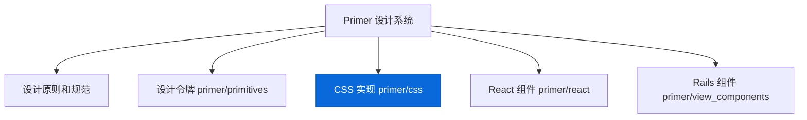
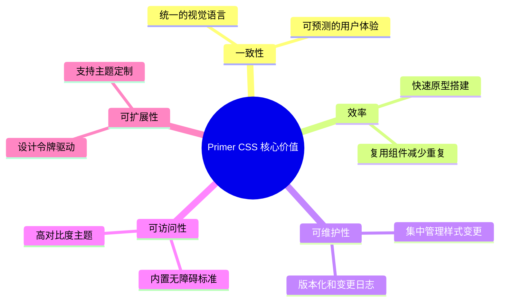
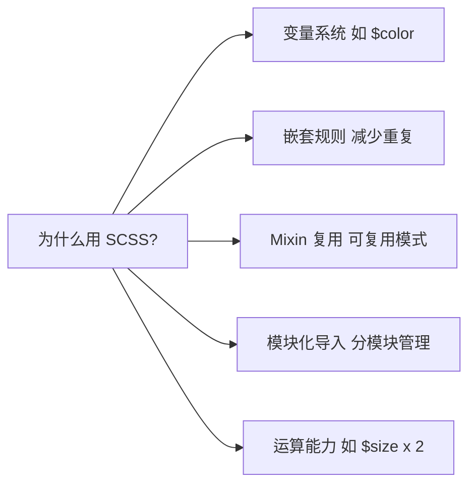
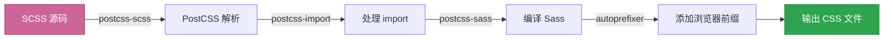

# 📖 第1章：Primer CSS 简介

> 🧑‍💻 🎨 本章适合：前端开发者、UI 设计师

---

## 🤔 什么是 Primer CSS？

**Primer CSS** 是 GitHub 官方的 CSS 设计系统实现。简单来说，它是 GitHub 团队把自己多年积累的 UI 样式规范，整理成了一套可以直接使用的 CSS 框架。

> 🍳 **通俗比喻**：如果你去一家米其林餐厅学做菜，主厨给你一本"秘方手册"——这本手册就是 Primer CSS。它不是教你怎么做菜，而是告诉你每道菜该用什么调料、什么火候、怎么摆盘。有了这本手册，你做出来的菜就能保持和餐厅一样的水准。

### Primer CSS 的定位



Primer CSS 是整个 Primer 设计系统中的一个核心部分，它负责**将设计规范转化为可用的 CSS 代码**。

---

## 🎯 为什么 GitHub 要做 Primer CSS？

### 问题背景

想象一下，GitHub 有数百位开发者同时在开发不同的页面和功能。如果没有统一的样式规范：

| 问题 | 没有 Primer 时 | 有了 Primer 后 |
|------|---------------|---------------|
| 按钮样式 | 每个人写的按钮长得不一样 | 统一的 `.btn` 类 |
| 颜色使用 | 各种 `#333`、`#666` 满天飞 | 语义化的 `color-fg-default` |
| 间距规则 | `margin: 12px` 还是 `15px`？ | 统一的 8px 网格系统 |
| 暗黑模式 | 每个页面单独适配 | 全局主题切换 |
| 无障碍 | 容易被忽略 | 内置 WCAG 标准 |

### 设计系统的核心价值



---

## 📦 Primer CSS 包含什么？

Primer CSS 的内容可以分为三大类：

### 1. 🧩 组件样式（Components）

预定义好的 UI 组件样式，拿来就用：

```html
<!-- 按钮组件 -->
<button class="btn btn-primary">提交</button>
<button class="btn btn-danger">删除</button>
<button class="btn btn-outline">取消</button>

<!-- 标签组件 -->
<span class="Label Label--primary">新功能</span>
<span class="Label Label--danger">Bug</span>

<!-- 头像组件 -->

```

### 2. 🔧 工具类（Utilities）

底层的原子化 CSS 类，用于快速布局和微调：

```html
<!-- 使用工具类快速构建布局 -->
<div class="d-flex flex-justify-between p-3 border rounded-2">
  <span class="text-bold color-fg-default">标题</span>
  <span class="color-fg-muted f6">2024-01-01</span>
</div>
```

### 3. 🎨 设计令牌（Design Tokens）

统一的变量和设计规范：

```scss
// 颜色令牌
$color-fg-default: var(--fgColor-default);
$color-bg-subtle: var(--bgColor-muted);

// 间距令牌
$spacer-1: 4px;  // 最小间距
$spacer-2: 8px;  // 基础间距
$spacer-3: 16px; // 常用间距

// 字体令牌
$h1-size: 32px;
$body-font-size: 14px;
```

---

## 🏛️ Primer CSS 与其他 CSS 框架的对比

你可能已经用过 Bootstrap、Tailwind CSS 等框架，那 Primer CSS 有什么不同？

| 特性 | Primer CSS | Bootstrap | Tailwind CSS |
|------|-----------|-----------|-------------|
| **定位** | GitHub 设计系统 | 通用 UI 框架 | 工具类优先框架 |
| **风格** | GitHub 品牌风格 | 中性风格 | 无预设风格 |
| **方法论** | 组件 + 工具类 | 组件优先 | 工具类优先 |
| **设计令牌** | ✅ 完整的令牌系统 | 部分 | ✅（JIT） |
| **暗黑模式** | ✅ 多主题支持 | ✅ | ✅ |
| **无障碍** | ✅ 内置 | 部分 | 需自行处理 |
| **文件大小** | 中等 | 较大 | 按需极小 |
| **学习曲线** | 中等 | 低 | 中等 |

### 什么时候适合使用 Primer CSS？

- ✅ 你在做与 GitHub 风格一致的产品
- ✅ 你想学习世界级设计系统是怎么构建的
- ✅ 你需要一个成熟的、经过大规模验证的 CSS 框架
- ✅ 你重视无障碍和多主题支持
- ❌ 你需要完全自定义品牌风格（考虑 Tailwind）
- ❌ 你需要开箱即用的 JavaScript 交互（考虑 Bootstrap）

---

## 🔍 Primer CSS 的技术选型

### 为什么选择 SCSS？

Primer CSS 的源码使用 **SCSS**（Sass 的一种语法）编写。这是因为：



> 💡 **为什么不用原生 CSS？** 虽然现代 CSS 已经有了变量（Custom Properties），但 SCSS 的 mixin、函数、模块化能力在大型项目中依然更强大。而且 Primer CSS 巧妙地将 SCSS 变量与 CSS 自定义属性结合使用——SCSS 负责编译时计算，CSS 自定义属性负责运行时主题切换。

### 构建工具链



---

## 📂 项目结构概览

让我们先对仓库结构有一个大局观：

```
primer-css/
├── src/                   # 📁 源码目录（核心！）
│   ├── index.scss         #    主入口文件
│   ├── base/              #    基础样式（HTML 元素重置）
│   ├── buttons/           #    按钮组件
│   ├── forms/             #    表单组件
│   ├── utilities/         #    工具类
│   ├── support/           #    变量和 mixin
│   ├── color-modes/       #    主题和颜色模式
│   └── ...                #    更多组件
├── dist/                  # 📁 编译后的 CSS 文件
├── docs/                  # 📁 文档站点
├── __tests__/             # 📁 测试文件
├── script/                # 📁 构建脚本
└── package.json           #    项目配置
```

> 📌 在后续章节中，我们会深入每个目录，理解其设计意图和实现细节。

---

## 🎓 本章小结

| 概念 | 说明 |
|------|------|
| Primer CSS | GitHub 官方 CSS 设计系统 |
| 设计令牌 | 统一的设计变量（颜色、间距、字体等） |
| 组件 | 预定义的 UI 样式（按钮、标签等） |
| 工具类 | 原子化的 CSS 类（间距、颜色等） |
| SCSS | 预处理器语言，编译后生成 CSS |
| PostCSS | 构建管道中的 CSS 处理工具 |

---

**下一章** 👉 [第2章：项目架构与设计理念](./02-architecture.md)
