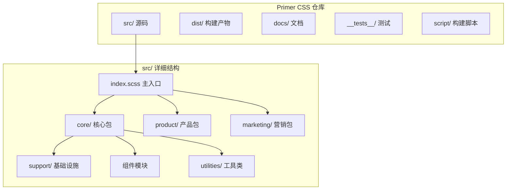
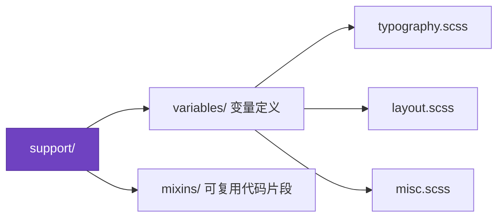
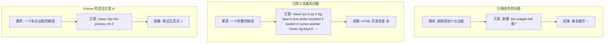
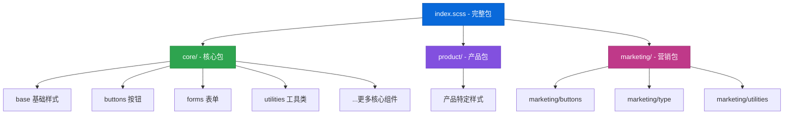
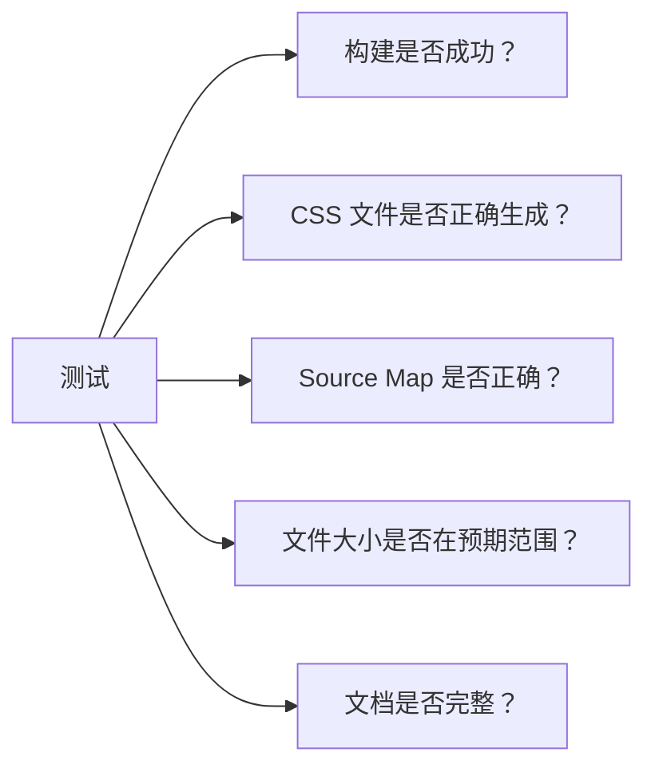
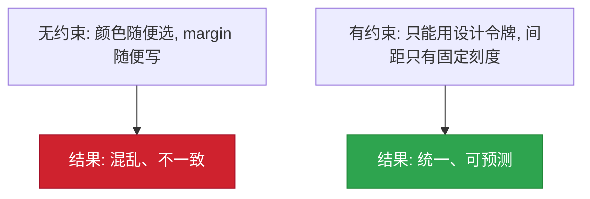

# 🏗️ 第2章：项目架构与设计理念

> 🧑‍💻 本章适合：前端开发者

---

## 🎯 本章目标

理解 Primer CSS 的项目结构、模块化设计、CSS 方法论，以及为什么这样组织代码。

---

## 📁 项目全景图



---

## 🧱 三层架构设计

Primer CSS 采用三层架构，这是理解整个项目的关键：

### 第一层：Support（基础设施层）



这一层就像盖房子的**地基**，定义了所有其他模块共享的基础设施：

```scss
// src/support/variables/typography.scss - 排版变量
$h1-size: 32px;
$h2-size: 24px;
$body-font-size: 14px;
$font-weight-bold: 600;

// src/support/variables/layout.scss - 布局变量
$spacer-1: 4px;    // 最小单位
$spacer-2: 8px;    // 基础单位
$spacer-3: 16px;   // 常用间距
$spacer-4: 24px;
$spacer-5: 32px;
$spacer-6: 40px;
```

> 🍳 **通俗比喻**：Support 层就像乐高积木的"基础底板"。你不会直接展示它，但没有它，其他积木就拼不起来。

**为什么要这样设计？**

- **单一数据源**（Single Source of Truth）：所有颜色、间距、字体大小都在一个地方定义
- **一处修改、全局生效**：改一个变量值，整个系统跟着变
- **防止"魔法数字"**：不再出现 `margin: 13px` 这种无来由的值

### 第二层：Components（组件层）

组件是用户直接使用的 UI 模块：

```
src/
├── buttons/       # 按钮
│   └── index.scss
├── forms/         # 表单
│   └── index.scss
├── labels/        # 标签
│   └── index.scss
├── navigation/    # 导航
│   └── index.scss
├── avatars/       # 头像
│   └── index.scss
├── toasts/        # 提示消息
│   └── index.scss
├── tooltips/      # 工具提示
│   └── index.scss
└── ...            # 更多组件
```

每个组件都是**独立的模块**，有自己的文件夹和入口文件。

> 🍳 **通俗比喻**：组件层就像乐高积木里的"成品模块"——一个小房子、一辆小车。你可以直接拿来用，也可以拆开重新组合。

### 第三层：Utilities（工具类层）

工具类提供底层的原子化样式：

```
src/utilities/
├── animations.scss    # 动画
├── borders.scss       # 边框
├── colors.scss        # 颜色
├── flexbox.scss       # 弹性布局
├── layout.scss        # 布局
├── margin.scss        # 外边距
├── padding.scss       # 内边距
├── typography.scss    # 排版
└── ...
```

> 🍳 **通俗比喻**：工具类就像乐高的"单个积木块"——一块 2×4 的红色积木。它很基础，但你可以用它拼出任何东西。

---

## 🎨 CSS 方法论：组件 + 工具类的混合模式

Primer CSS 没有完全采用 BEM（Block Element Modifier），也没有完全采用 Tailwind 那种纯工具类方式，而是**两者结合**：

### 组件命名规范

```scss
// 块（Block）—— 组件的主体
.btn { }           // 按钮
.Label { }         // 标签（注意大写开头）
.Box { }           // 盒子
.Header { }        // 头部

// 修饰符（Modifier）—— 组件的变体
.btn-primary { }   // 主要按钮（使用连字符）
.btn-danger { }    // 危险按钮
.btn-sm { }        // 小按钮
.Label--primary { }// 主要标签（使用双连字符）

// 元素（Element）—— 组件的子元素
.Header-item { }   // 头部项（使用连字符）
.Box-row { }       // 盒子行
```

### 为什么混合使用？



**原则：组件定义"是什么"，工具类定义"微调什么"。**

---

## 📦 三大 Bundle（包）

Primer CSS 将组件组织成三个包，便于按需加载：



### 为什么分成三个包？

| 包名 | 使用场景 | 说明 |
|------|---------|------|
| **core** | 所有 GitHub 页面 | 最基础的样式，必须加载 |
| **product** | GitHub.com 产品页面 | 代码浏览、Issue 列表等特定页面 |
| **marketing** | GitHub 营销页面 | 首页、定价页等营销内容 |

> 💡 **为什么要分包？** 一个字：**性能**。GitHub.com 的营销页面不需要加载代码浏览的样式，反过来也一样。分包可以让每个页面只加载必要的 CSS，减少首屏渲染时间。

---

## 🔄 入口文件的组织方式

让我们看看 `src/index.scss` 是怎么组织的：

```scss
// src/index.scss - 主入口（简化版）
@import './core/index.scss';        // 核心包
@import './product/index.scss';     // 产品包
@import './marketing/index.scss';   // 营销包
```

每个包内部又通过 `@import` 导入各个组件：

```scss
// src/core/index.scss（示意）
@import '../support/index.scss';    // 首先加载基础设施
@import '../base/index.scss';       // 然后是基础样式
@import '../buttons/index.scss';    // 接着是组件
@import '../forms/index.scss';
@import '../utilities/index.scss';  // 最后是工具类
// ...
```

> ⚠️ **加载顺序很重要！** Support 必须最先加载（因为其他模块依赖它的变量），Utilities 通常最后加载（因为工具类需要覆盖组件样式的能力）。

---

## 🧪 测试策略

Primer CSS 有自己的自动化测试来保证质量：

```
__tests__/
├── build.test.js    # 构建产物测试
├── css.test.js      # CSS 输出测试
└── docs.test.js     # 文档测试
```

### 测试什么？



> 💡 **为什么要测试 CSS？** 你可能觉得"CSS 也要测试？"。对于设计系统来说，一个不小心的改动可能影响到 GitHub.com 上数千个页面。自动化测试可以在合并代码之前发现问题。

---

## 🛠️ 工程化配置

### 代码质量工具

| 工具 | 配置文件 | 作用 |
|------|---------|------|
| **Stylelint** | `stylelint.config.cjs` | 检查 SCSS 代码规范 |
| **ESLint** | `eslint.config.cjs` | 检查构建脚本的 JS 代码 |
| **Prettier** | `prettier.config.cjs` | 统一代码格式 |
| **Changesets** | `.changeset/config.json` | 自动化版本管理 |

### Stylelint 的作用示例

```scss
// ❌ Stylelint 会报错的写法
.my-button {
  color: #333;           // 不允许直接使用颜色值
  margin: 13px;          // 不在间距刻度表中
  font-size: 15px;       // 不在字号刻度表中
}

// ✅ 正确的写法
.my-button {
  color: var(--fgColor-default);    // 使用设计令牌
  margin: $spacer-3;                 // 使用间距变量 (16px)
  font-size: $h4-size;               // 使用排版变量
}
```

> 💡 **为什么需要 Stylelint？** 设计系统的一致性靠的不是"大家说好遵守规范"，而是**工具强制执行**。Stylelint 会在你写出不符合规范的代码时立即警告，就像拼写检查一样。

---

## 📐 设计原则

Primer CSS 的架构体现了几个重要的设计原则：

### 1. 约束驱动设计（Constraint-Driven Design）



> 🍳 **通俗比喻**：乐高积木为什么能拼出精美的模型？因为每块积木的大小都是固定的——1×1、2×4、1×6。正是这种"约束"让不同的人拼出来的东西风格一致。如果积木大小随意，拼出来的就是一堆废墟。

### 2. 渐进增强（Progressive Enhancement）

Primer CSS 的 CSS 自定义属性（CSS Variables）设计体现了渐进增强：

```scss
// 核心样式使用 SCSS 变量（编译时确定，保证基本可用）
.btn {
  padding: $spacer-2 $spacer-3;
}

// 主题颜色使用 CSS 自定义属性（运行时可变，支持主题切换）
.btn-primary {
  background-color: var(--bgColor-accent-emphasis);
  color: var(--fgColor-onEmphasis);
}
```

### 3. 关注点分离（Separation of Concerns）

```
support/    → "什么值可以用"（变量和工具）
components/ → "长什么样"（视觉表现）
utilities/  → "怎么微调"（布局和修饰）
color-modes/→ "什么时候变色"（主题切换）
```

---

## 🎓 本章小结

| 概念 | 说明 |
|------|------|
| 三层架构 | Support（基础设施）→ Components（组件）→ Utilities（工具类） |
| 三大 Bundle | Core（核心）+ Product（产品）+ Marketing（营销） |
| 命名规范 | 大写开头组件名 + 连字符修饰符 |
| 加载顺序 | Support → Base → Components → Utilities |
| 混合方法论 | 组件定义"是什么"，工具类定义"微调什么" |
| 约束驱动 | 通过设计令牌限制可用值，保证一致性 |

---

**上一章** 👈 [第1章：Primer CSS 简介](./01-introduction.md)

**下一章** 👉 [第3章：快速开始](./03-getting-started.md)
