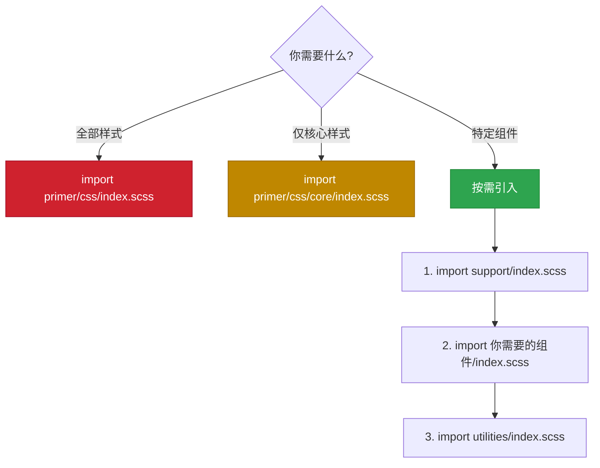
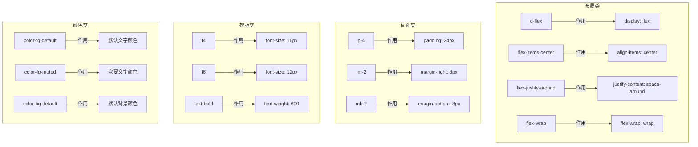
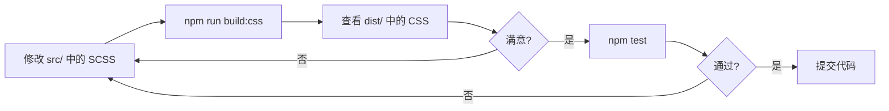

# 🚀 第3章：快速开始

> 🧑‍💻 本章适合：前端开发者

---

## 🎯 本章目标

学会安装、引入 Primer CSS，并搭建你的第一个页面。

---

## 📦 安装方式

### 方式一：npm 安装（推荐）

```bash
# 使用 npm
npm install @primer/css

# 使用 yarn
yarn add @primer/css

# 使用 pnpm
pnpm add @primer/css
```

### 方式二：CDN 引入（快速体验）

```html
<link rel="stylesheet" href="https://unpkg.com/@primer/css@22/dist/primer.css">
```

> 💡 CDN 方式适合快速试用和学习，生产环境建议使用 npm 安装以便按需引入。

---

## 🔌 引入方式

### 引入完整包

```scss
// 在你的 SCSS 文件中
@import '@primer/css/index.scss';
```

### 按需引入（推荐）

```scss
// 必须先引入 support（基础设施）
@import '@primer/css/support/index.scss';

// 然后按需引入组件
@import '@primer/css/base/index.scss';
@import '@primer/css/buttons/index.scss';
@import '@primer/css/forms/index.scss';
@import '@primer/css/utilities/index.scss';
```

### 引入编译后的 CSS

```typescript
// 在 TypeScript/JavaScript 项目中
import '@primer/css/dist/primer.css';

// 或者按 bundle 引入
import '@primer/css/dist/core.css';
import '@primer/css/dist/product.css';
```

### 按需引入流程图



---

## 🏗️ 项目集成示例

### 在 Vite + TypeScript 项目中使用

```bash
# 创建项目
npm create vite@latest my-primer-app -- --template vanilla-ts

# 进入项目目录
cd my-primer-app

# 安装 Primer CSS
npm install @primer/css
```

在 `src/style.css` 中引入：

```css
/* 引入编译后的 CSS */
@import '@primer/css/dist/primer.css';
```

或者在 `src/main.ts` 中：

```typescript
// TypeScript 方式引入
import '@primer/css/dist/primer.css';

// 现在可以在 HTML 中使用 Primer 的类名了
const app = document.querySelector<HTMLDivElement>('#app')!;
app.innerHTML = `
  <div class="Box p-4">
    <h1 class="f2 text-bold mb-2">Hello Primer! 👋</h1>
    <p class="color-fg-muted mb-3">这是我的第一个 Primer CSS 页面</p>
    <button class="btn btn-primary">开始使用</button>
  </div>
`;
```

### 在 React + TypeScript 项目中使用

```bash
# 创建 React 项目
npm create vite@latest my-primer-react -- --template react-ts

# 安装
cd my-primer-react
npm install @primer/css
```

```tsx
// src/App.tsx
import '@primer/css/dist/primer.css';

function App() {
  return (
    <div className="Box p-4 m-4">
      <h1 className="f2 text-bold mb-2">Hello Primer! 👋</h1>
      <p className="color-fg-muted mb-3">
        这是用 React + Primer CSS 构建的页面
      </p>
      <div className="d-flex gap-2">
        <button className="btn btn-primary">主要按钮</button>
        <button className="btn btn-outline">次要按钮</button>
        <button className="btn btn-danger">危险按钮</button>
      </div>
    </div>
  );
}

export default App;
```

---

## ✍️ 第一个页面：GitHub 风格的个人卡片

让我们用 Primer CSS 做一个 GitHub 风格的个人信息卡片：

```html
<!DOCTYPE html>
<html lang="zh-CN">
<head>
  <meta charset="UTF-8">
  <meta name="viewport" content="width=device-width, initial-scale=1.0">
  <title>我的 Primer 卡片</title>
  <link rel="stylesheet" href="https://unpkg.com/@primer/css@22/dist/primer.css">
</head>
<body class="color-bg-default p-4">

  <!-- 个人信息卡片 -->
  <div class="Box Box--condensed" style="max-width: 400px;">
    <!-- 卡片头部 -->
    <div class="Box-header d-flex flex-items-center">
      
      <div>
        <h3 class="f4 text-bold">Octocat</h3>
        <span class="color-fg-muted f6">@octocat</span>
      </div>
    </div>

    <!-- 个人简介 -->
    <div class="Box-body">
      <p class="color-fg-default mb-2">
        🐙 GitHub 的吉祥物，热爱开源和编程。
      </p>
      <div class="d-flex flex-wrap gap-1 mb-2">
        <span class="Label Label--secondary">JavaScript</span>
        <span class="Label Label--secondary">TypeScript</span>
        <span class="Label Label--secondary">CSS</span>
      </div>
    </div>

    <!-- 统计信息 -->
    <div class="Box-footer d-flex flex-justify-around color-fg-muted f6">
      <span>📦 仓库 <strong class="color-fg-default">42</strong></span>
      <span>⭐ 粉丝 <strong class="color-fg-default">1.2k</strong></span>
      <span>👀 关注 <strong class="color-fg-default">28</strong></span>
    </div>
  </div>

</body>
</html>
```

### 代码解析

让我们逐一理解用到的 Primer 类：



| 类名 | 类型 | 作用 | CSS 等价 |
|------|------|------|---------|
| `Box` | 组件 | 卡片容器 | 带边框和圆角的容器 |
| `Box-header` | 组件元素 | 卡片头部 | 带背景色的头部区域 |
| `Box-body` | 组件元素 | 卡片主体 | 内容区域 |
| `Box-footer` | 组件元素 | 卡片底部 | 底部区域 |
| `avatar` | 组件 | 圆形头像 | 圆形裁剪的图片 |
| `d-flex` | 工具类 | 弹性布局 | `display: flex` |
| `p-4` | 工具类 | 内边距 | `padding: 24px` |
| `mr-2` | 工具类 | 右外边距 | `margin-right: 8px` |
| `f4` | 工具类 | 字号 | `font-size: 16px` |
| `text-bold` | 工具类 | 加粗 | `font-weight: 600` |
| `color-fg-muted` | 工具类 | 次要文字色 | 主题相关的灰色 |
| `Label` | 组件 | 标签 | 小的标签样式 |

---

## 🧪 本地开发 Primer CSS 源码

如果你想深入研究或贡献代码：

```bash
# 1. 克隆仓库
git clone https://github.com/primer/css.git primer-css
cd primer-css

# 2. 安装依赖
npm install

# 3. 构建 CSS
npm run build:css

# 4. 查看构建产物
ls dist/
# 输出：core.css  marketing.css  primer.css  product.css  ...

# 5. 启动文档站点（Storybook）
npm run storybook

# 6. 运行测试
npm test

# 7. 运行代码检查
npm run stylelint
```

### 开发流程



---

## ⚙️ 构建配置详解

### PostCSS 配置

```javascript
// postcss.config.cjs（简化版）
module.exports = {
  // 使用 SCSS 语法解析器
  syntax: require('postcss-scss'),
  plugins: [
    // 1. 处理 @import 语句，合并文件
    require('postcss-import'),
    // 2. 编译 Sass/SCSS 为标准 CSS
    require('@csstools/postcss-sass'),
    // 3. 自动添加浏览器前缀
    require('autoprefixer'),
  ],
};
```

### 为什么用 PostCSS 而不是 dart-sass？

| 特性 | PostCSS + Sass 插件 | dart-sass |
|------|---------------------|-----------|
| 管道化处理 | ✅ 可以串联多个插件 | ❌ 需要额外配置 |
| 自动前缀 | ✅ autoprefixer 无缝集成 | 需要单独运行 |
| 自定义处理 | ✅ 生态丰富 | 有限 |
| 构建速度 | 快 | 更快 |

> 💡 PostCSS 不是 Sass 的替代品，而是一个 CSS 处理的"管道"。Primer CSS 用 PostCSS 作为管道，把 Sass 编译作为其中一个环节。

---

## 🎓 本章小结

| 步骤 | 说明 |
|------|------|
| 安装 | `npm install @primer/css` |
| 引入 | 完整引入或按需引入 SCSS/CSS |
| 使用 | 在 HTML 元素上添加类名 |
| 开发 | 修改 src/ → 构建 → 测试 |
| 构建 | PostCSS 管道处理 SCSS |

**常用命令速查：**

```bash
npm install @primer/css     # 安装
npm run build:css           # 构建
npm run storybook           # 文档
npm test                    # 测试
npm run stylelint           # 代码检查
```

---

**上一章** 👈 [第2章：项目架构与设计理念](./02-architecture.md)

**下一章** 👉 [第4章：设计令牌（Design Tokens）](./04-design-tokens.md)
