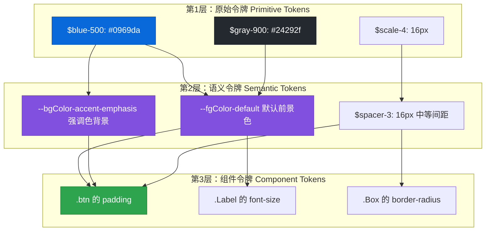
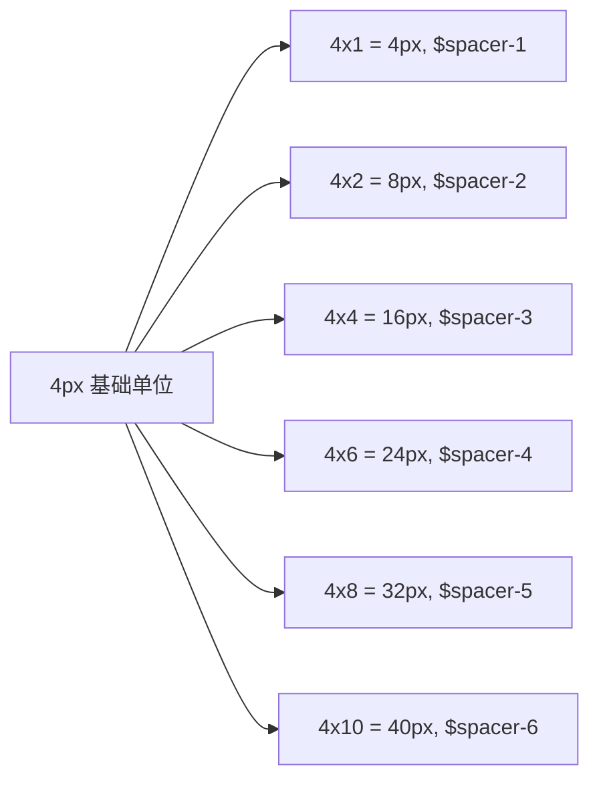
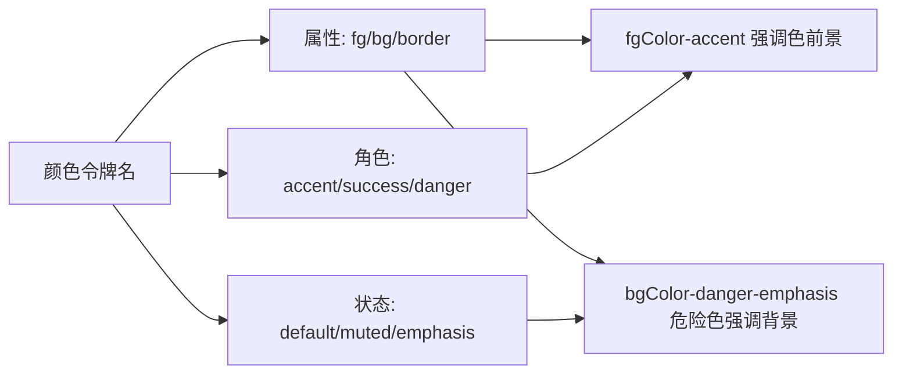
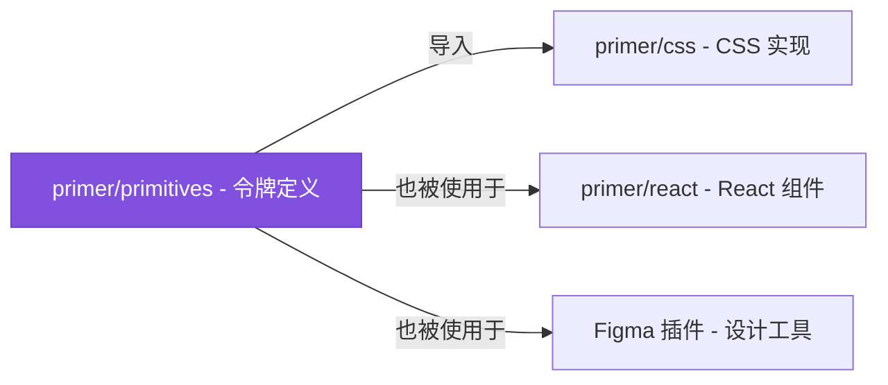
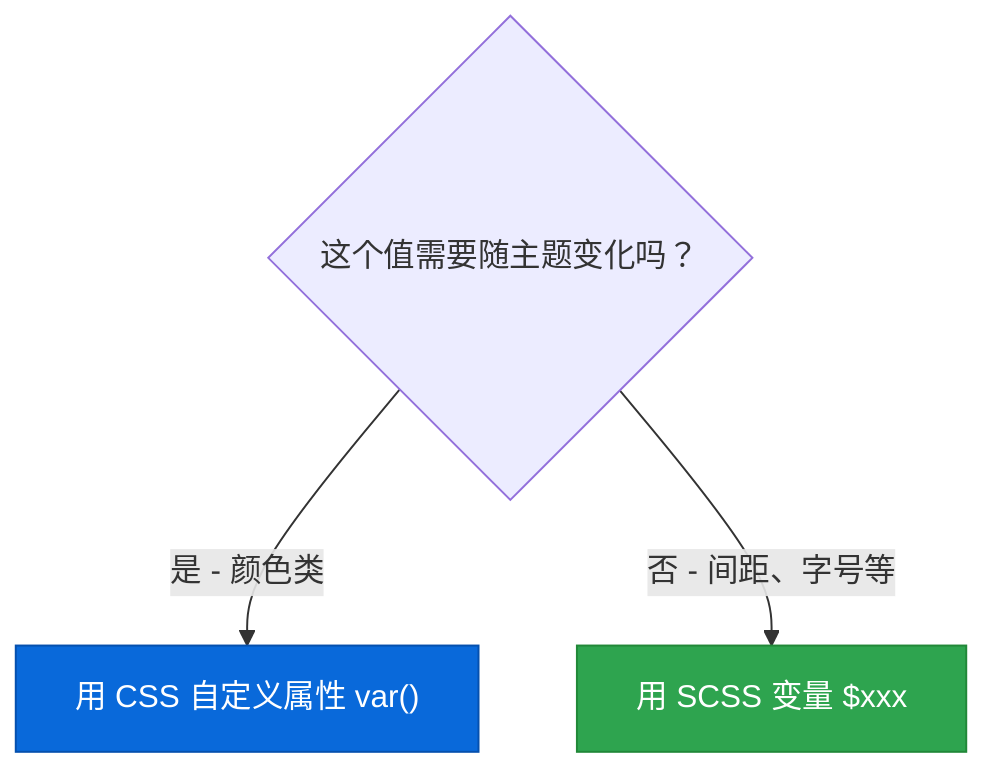

# 🎨 第4章：设计令牌（Design Tokens）

> 🧑‍💻 🎨 本章适合：前端开发者、UI 设计师

---

## 🎯 本章目标

理解设计令牌的概念、为什么需要它、以及 Primer CSS 中的令牌体系。

---

## 🤔 什么是设计令牌？

**设计令牌（Design Token）** 是设计系统中最小的"决策单元"。它是一个**命名过的设计值**，用来替代硬编码的数字。

> 🍳 **通俗比喻**：想象你开一家连锁咖啡店。如果每家店的咖啡师自己决定放多少糖——有人放一勺，有人放三勺——顾客在不同的店喝到的味道就不一样。设计令牌就是"统一的配方表"：拿铁放2勺糖、卡布奇诺放1.5勺。每个人照着配方做，味道就一致了。

### 硬编码 vs 设计令牌

```scss
// ❌ 硬编码 —— 容易不一致
.card {
  color: #24292f;
  background: #ffffff;
  border: 1px solid #d0d7de;
  border-radius: 6px;
  padding: 16px;
  font-size: 14px;
}

// ✅ 使用设计令牌 —— 统一且可维护
.card {
  color: var(--fgColor-default);
  background: var(--bgColor-default);
  border: 1px solid var(--borderColor-default);
  border-radius: $border-radius;
  padding: $spacer-3;
  font-size: $body-font-size;
}
```

---

## 🏗️ Primer 的令牌架构

Primer CSS 的令牌分为三个层级：



### 为什么需要三层？

| 层级 | 作用 | 例子 | 谁关心？ |
|------|------|------|---------|
| **原始令牌** | 定义所有可用的值 | `$blue-500: #0969da` | 设计系统维护者 |
| **语义令牌** | 赋予值以含义 | `--fgColor-accent` 而不是 `$blue-500` | 设计师 + 开发者 |
| **组件令牌** | 组件内部使用 | `.btn` 的 padding 用 `$spacer-2` | 开发者 |

> 🍳 **通俗比喻**：
> - **原始令牌** = 颜料管（红色、蓝色、黄色...）
> - **语义令牌** = 调色板（"天空色"、"草地色"、"警告色"）
> - **组件令牌** = 配色方案（"按钮用天空色"、"错误提示用警告色"）

---

## 📐 间距令牌（Spacing Tokens）

Primer CSS 使用 **4px 为基础单位的间距系统**：

```scss
// src/support/variables/layout.scss
$spacer-1: 4px;    // 极小间距
$spacer-2: 8px;    // 小间距
$spacer-3: 16px;   // 标准间距
$spacer-4: 24px;   // 中等间距
$spacer-5: 32px;   // 大间距
$spacer-6: 40px;   // 极大间距
```

### 为什么用 4px 网格？



> 🍳 **通俗比喻**：音乐有节拍（4/4 拍、3/4 拍），间距系统也有"节拍"。4px 就是 Primer 的基础节拍。所有间距都是这个节拍的倍数，所以页面看起来"有韵律感"。如果某个地方用了 13px 的间距，就像音乐突然跑调了——违和感很强。

### 间距在代码中的使用

```html
<!-- 使用间距工具类 -->
<div class="p-0">无内边距 (0px)</div>
<div class="p-1">极小内边距 (4px)</div>
<div class="p-2">小内边距 (8px)</div>
<div class="p-3">标准内边距 (16px)</div>
<div class="p-4">中等内边距 (24px)</div>
<div class="p-5">大内边距 (32px)</div>
<div class="p-6">极大内边距 (40px)</div>

<!-- 方向控制 -->
<div class="pt-3">上内边距 16px</div>
<div class="pr-3">右内边距 16px</div>
<div class="pb-3">下内边距 16px</div>
<div class="pl-3">左内边距 16px</div>
<div class="px-3">左右内边距 16px</div>
<div class="py-3">上下内边距 16px</div>

<!-- 外边距也类似 -->
<div class="m-3">四周外边距 16px</div>
<div class="mt-3">上外边距 16px</div>
<div class="mx-auto">水平居中</div>
```

---

## ✍️ 排版令牌（Typography Tokens）

```scss
// src/support/variables/typography.scss

// 字号比例（从大到小）
$h00-size-mobile: 40px;   // 超大标题（移动端）
$h0-size-mobile: 32px;    // 特大标题（移动端）
$h1-size-mobile: 26px;    // 一级标题（移动端）
$h2-size-mobile: 22px;    // 二级标题（移动端）
$h3-size-mobile: 18px;    // 三级标题（移动端）

// 字重
$font-weight-bold: 600;
$font-weight-semibold: 500;
$font-weight-normal: 400;
$font-weight-light: 300;

// 行高
$lh-condensed-ultra: 1;      // 极紧凑
$lh-condensed: 1.25;          // 紧凑
$lh-default: 1.5;             // 默认
```

### 排版比例的视觉效果

```
h00 ████████████████████████ 40px  (展示性超大标题)
h0  ███████████████████░░░░░ 32px  (落地页大标题)
h1  ███████████████░░░░░░░░░ 26px  (页面标题)
h2  ████████████░░░░░░░░░░░░ 22px  (章节标题)
h3  ██████████░░░░░░░░░░░░░░ 18px  (小节标题)
h4  ████████░░░░░░░░░░░░░░░░ 16px  (强调文本)
h5  ███████░░░░░░░░░░░░░░░░░ 14px  (正文)
h6  █████░░░░░░░░░░░░░░░░░░░ 12px  (辅助文本)
```

---

## 🎨 颜色令牌概览

颜色令牌是 Primer 中最复杂的部分（下一章详细讲），这里先了解基本概念：

### 语义化命名

```scss
// ❌ 按颜色命名 —— 换主题就完蛋
$button-color: $blue-500;

// ✅ 按用途命名 —— 主题切换自如
$button-color: var(--bgColor-accent-emphasis);
// 浅色主题下是蓝色，暗黑主题下可能是浅蓝色
```

### Primer 的颜色令牌命名规则



命名公式：`--{属性}Color-{角色}-{状态}`

| 属性 | 含义 | 例子 |
|------|------|------|
| `fg` | 前景色（文字） | `--fgColor-default` |
| `bg` | 背景色 | `--bgColor-default` |
| `border` | 边框色 | `--borderColor-default` |

| 角色 | 含义 | 常见场景 |
|------|------|---------|
| `default` | 默认 | 普通文字和背景 |
| `muted` | 次要 | 辅助文字 |
| `accent` | 强调 | 链接、主要按钮 |
| `success` | 成功 | 成功提示 |
| `attention` | 注意 | 警告信息 |
| `danger` | 危险 | 错误、删除操作 |

---

## 🔗 令牌来源：@primer/primitives

Primer CSS 的设计令牌来自另一个包 `@primer/primitives`：



> 💡 **为什么令牌独立成包？** 因为设计令牌不只是 CSS 用——React 组件、Figma 设计工具、移动端 App 都需要同一套值。独立成包后，改一处就能同步到所有平台。

---

## 🧰 在代码中使用令牌

### SCSS 变量方式

```scss
// 编译时确定，不支持运行时切换
.my-component {
  padding: $spacer-3;           // 16px
  font-weight: $font-weight-bold; // 600
  border-radius: $border-radius;  // 6px
}
```

### CSS 自定义属性方式

```scss
// 运行时可变，支持主题切换
.my-component {
  color: var(--fgColor-default);
  background: var(--bgColor-default);
  border-color: var(--borderColor-default);
}
```

### 什么时候用哪种？



| 类型 | 用哪种 | 原因 |
|------|--------|------|
| 颜色 | CSS 自定义属性 | 需要随主题切换 |
| 间距 | SCSS 变量 | 所有主题共享同一间距 |
| 字号 | SCSS 变量 | 所有主题共享同一字号 |
| 字重 | SCSS 变量 | 所有主题共享同一字重 |
| 圆角 | SCSS 变量 | 所有主题共享同一圆角 |
| 阴影 | CSS 自定义属性 | 暗黑模式下阴影可能不同 |

---

## 📋 实战：自定义组件使用令牌

让我们用设计令牌创建一个"通知卡片"组件：

```html
<div class="notification-card">
  <div class="notification-card-icon">ℹ️</div>
  <div class="notification-card-content">
    <h4 class="notification-card-title">系统通知</h4>
    <p class="notification-card-message">你有一条新消息</p>
  </div>
</div>
```

```scss
// 使用令牌编写样式
.notification-card {
  display: flex;
  align-items: flex-start;
  padding: $spacer-3;                          // 16px 内边距
  border: 1px solid var(--borderColor-default); // 语义化边框色
  border-radius: $border-radius;                // 统一圆角
  background: var(--bgColor-default);           // 语义化背景色

  &-icon {
    margin-right: $spacer-2;                    // 8px 间距
    font-size: $h3-size-mobile;                 // 18px
  }

  &-title {
    font-size: $h4-size;                        // 16px
    font-weight: $font-weight-semibold;         // 500
    color: var(--fgColor-default);              // 语义化文字色
    margin-bottom: $spacer-1;                   // 4px
  }

  &-message {
    font-size: $body-font-size;                 // 14px
    color: var(--fgColor-muted);               // 次要文字色
    line-height: $lh-default;                   // 1.5
  }
}
```

> 🎯 注意：这个组件的颜色会自动跟随主题切换（因为用了 CSS 自定义属性），而间距和字号在所有主题中保持一致（因为用了 SCSS 变量）。

---

## 🎓 本章小结

| 概念 | 说明 |
|------|------|
| 设计令牌 | 命名过的设计值，替代硬编码数字 |
| 三层架构 | 原始令牌 → 语义令牌 → 组件令牌 |
| 间距系统 | 基于 4px 网格，$spacer-1 到 $spacer-6 |
| 排版系统 | 从 h00 到 h6 的字号比例 |
| 颜色命名 | `--{属性}Color-{角色}-{状态}` 格式 |
| SCSS vs CSS 变量 | 固定值用 SCSS，主题相关用 CSS 自定义属性 |
| @primer/primitives | 令牌的源头，跨平台共享 |

---

**上一章** 👈 [第3章：快速开始](./03-getting-started.md)

**下一章** 👉 [第5章：颜色系统与主题](./05-color-system.md)
