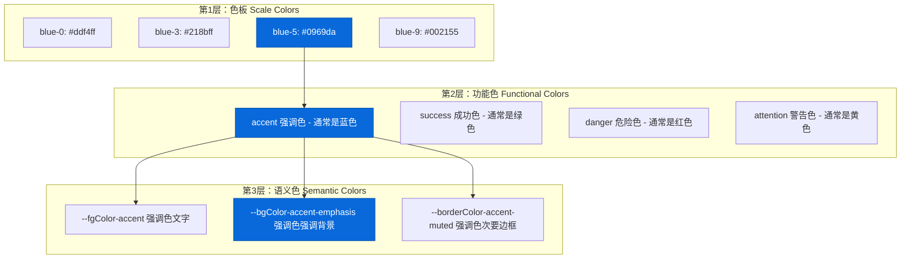
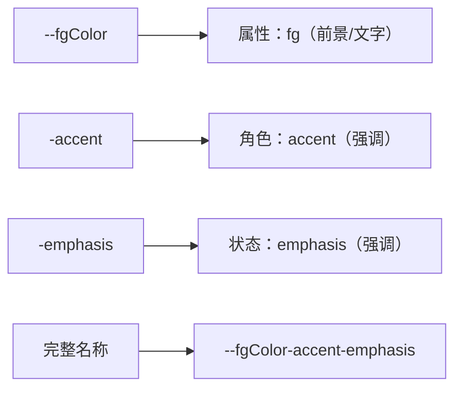
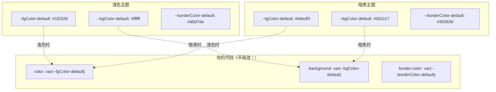
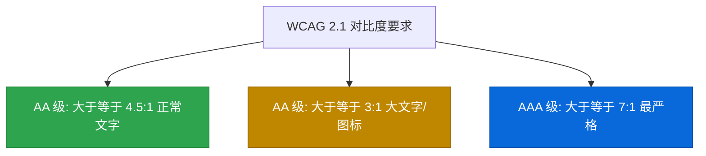
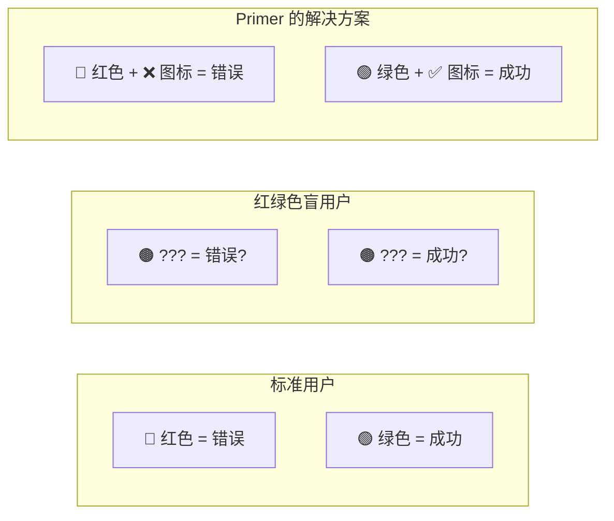

# 🌈 第5章：颜色系统与主题

> 🧑‍💻 🎨 本章适合：前端开发者、UI 设计师

---

## 🎯 本章目标

深入理解 Primer CSS 的颜色系统：颜色的组织方式、语义化命名、主题切换原理、以及无障碍设计。

---

## 🤔 为什么颜色需要"系统"？

你可能见过这样的 CSS 代码：

```css
/* 😱 颜色噩梦 */
.header { background: #24292e; }
.title { color: #333; }
.subtitle { color: #586069; }
.link { color: #0366d6; }
.button { background: #2ea44f; }
.error { color: #d73a49; }
.card { border: 1px solid #e1e4e8; }
```

看起来没什么问题？但当产品经理说"我们要做暗黑模式"的时候...

```css
/* 😵 暗黑模式：每个颜色都要改一遍 */
@media (prefers-color-scheme: dark) {
  .header { background: #161b22; }
  .title { color: #c9d1d9; }
  .subtitle { color: #8b949e; }
  .link { color: #58a6ff; }
  .button { background: #238636; }
  .error { color: #f85149; }
  .card { border: 1px solid #30363d; }
}
/* 如果有100个组件，就要改100次... */
```

> 🍳 **通俗比喻**：这就像装修房子时，如果墙壁颜色写在每块砖上，想换个墙色就得一块砖一块砖地改。而如果你用一桶"墙面漆"——换桶漆就换了整面墙的颜色。颜色系统就是那桶"漆"。

---

## 🏗️ Primer 的颜色架构

### 三层颜色体系



---

## 🎨 语义化颜色命名

### 命名公式

```
--{属性}Color-{角色}-{状态}
```



### 所有属性（Property）

| 属性前缀 | 含义 | 使用场景 |
|----------|------|---------|
| `fgColor` | 前景色 | 文字、图标 |
| `bgColor` | 背景色 | 容器背景、按钮背景 |
| `borderColor` | 边框色 | 容器边框、分隔线 |

### 所有角色（Role）

| 角色 | 含义 | 浅色主题颜色 | 使用场景 |
|------|------|-------------|---------|
| `default` | 默认 | 黑/白 | 普通文字和背景 |
| `muted` | 柔和 | 灰色 | 次要文字、禁用状态 |
| `accent` | 强调 | 蓝色 | 链接、主要操作 |
| `success` | 成功 | 绿色 | 成功提示、合并 |
| `attention` | 注意 | 黄色 | 警告、需关注 |
| `severe` | 严重 | 橙色 | 严重警告 |
| `danger` | 危险 | 红色 | 错误、删除 |
| `open` | 打开 | 绿色 | Issue/PR 打开状态 |
| `closed` | 关闭 | 红色 | Issue/PR 关闭状态 |
| `done` | 完成 | 紫色 | 已完成状态 |

### 所有状态（State）

| 状态 | 含义 | 视觉效果 |
|------|------|---------|
| 无后缀 | 默认状态 | 标准颜色 |
| `muted` | 柔和 | 更淡、更轻 |
| `emphasis` | 强调 | 更浓、更重 |

---

## 🌓 主题切换原理

### CSS 自定义属性的魔法



### 主题定义文件

```
src/color-modes/themes/
├── light.scss                 # 浅色主题（默认）
├── dark.scss                  # 暗黑主题
├── dark_dimmed.scss           # 暗黑柔和主题
├── dark_high_contrast.scss    # 暗黑高对比度
├── dark_colorblind.scss       # 暗黑色盲友好
├── dark_tritanopia.scss       # 暗黑三色觉异常
├── light_colorblind.scss      # 浅色色盲友好
├── light_high_contrast.scss   # 浅色高对比度
└── light_tritanopia.scss      # 浅色三色觉异常
```

### 主题切换的实现方式

```html
<!-- 通过 data 属性切换主题 -->
<html data-color-mode="light">       <!-- 浅色 -->
<html data-color-mode="dark">        <!-- 暗黑 -->

<!-- 通过 data 属性选择具体主题 -->
<html data-light-theme="light" data-dark-theme="dark_dimmed">
```

```scss
// 主题定义的简化示例
[data-color-mode="light"] {
  --fgColor-default: #1f2328;
  --bgColor-default: #ffffff;
  --borderColor-default: #d0d7de;
  --fgColor-accent: #0969da;
  // ... 几百个颜色变量
}

[data-color-mode="dark"] {
  --fgColor-default: #e6edf3;
  --bgColor-default: #0d1117;
  --borderColor-default: #30363d;
  --fgColor-accent: #4493f8;
  // ... 几百个颜色变量
}
```

---

## 🎯 颜色使用实战

### 文字颜色

```html
<!-- 主要文字 -->
<p class="color-fg-default">这是主要文字</p>

<!-- 次要文字 -->
<p class="color-fg-muted">这是次要文字，如描述信息</p>

<!-- 强调文字（蓝色链接色） -->
<a href="#" class="color-fg-accent">这是一个链接</a>

<!-- 成功文字 -->
<span class="color-fg-success">✅ 操作成功</span>

<!-- 警告文字 -->
<span class="color-fg-attention">⚠️ 请注意</span>

<!-- 危险文字 -->
<span class="color-fg-danger">❌ 操作失败</span>
```

### 背景颜色

```html
<!-- 默认背景 -->
<div class="color-bg-default p-3">默认背景</div>

<!-- 次要背景（浅灰） -->
<div class="color-bg-subtle p-3">次要背景，用于区分区域</div>

<!-- 强调背景 -->
<div class="color-bg-accent-emphasis color-fg-on-emphasis p-3">
  强调背景（蓝底白字）
</div>

<!-- 成功背景 -->
<div class="color-bg-success-emphasis color-fg-on-emphasis p-3">
  成功背景（绿底白字）
</div>

<!-- 危险背景 -->
<div class="color-bg-danger-emphasis color-fg-on-emphasis p-3">
  危险背景（红底白字）
</div>
```

### 边框颜色

```html
<!-- 默认边框 -->
<div class="border color-border-default p-3">默认边框</div>

<!-- 强调边框 -->
<div class="border color-border-accent-emphasis p-3">强调边框（蓝色）</div>

<!-- 成功边框 -->
<div class="border color-border-success p-3">成功边框（绿色）</div>
```

---

## ♿ 无障碍颜色设计

### WCAG 对比度要求



### Primer 如何保证无障碍？

1. **高对比度主题**：为视力不佳的用户提供更高对比度

```
标准主题   → 对比度约 4.5:1（满足 AA 标准）
高对比度   → 对比度约 7:1+ （满足 AAA 标准）
```

2. **色盲友好主题**：避免仅靠颜色传达信息



3. **不仅靠颜色**：所有颜色信息都有文字或图标辅助

> 🍳 **通俗比喻**：红绿灯不只有颜色——红灯在上面，绿灯在下面。即使你分不清红绿色，也能通过位置判断。Primer 的无障碍设计遵循同样的原则：颜色只是"加分项"，不是唯一的信息传达方式。

---

## 🛠️ 实战：使用颜色系统构建状态卡片

```html
<!-- 信息卡片 -->
<div class="Box color-border-accent-emphasis p-3 mb-3">
  <div class="d-flex flex-items-center mb-2">
    <span class="color-fg-accent mr-2">ℹ️</span>
    <strong class="color-fg-default">提示信息</strong>
  </div>
  <p class="color-fg-muted f6 mb-0">这是一条信息提示</p>
</div>

<!-- 成功卡片 -->
<div class="Box color-border-success-emphasis p-3 mb-3">
  <div class="d-flex flex-items-center mb-2">
    <span class="color-fg-success mr-2">✅</span>
    <strong class="color-fg-default">操作成功</strong>
  </div>
  <p class="color-fg-muted f6 mb-0">你的更改已保存</p>
</div>

<!-- 警告卡片 -->
<div class="Box color-border-attention-emphasis p-3 mb-3">
  <div class="d-flex flex-items-center mb-2">
    <span class="color-fg-attention mr-2">⚠️</span>
    <strong class="color-fg-default">请注意</strong>
  </div>
  <p class="color-fg-muted f6 mb-0">这个操作不可撤销</p>
</div>

<!-- 错误卡片 -->
<div class="Box color-border-danger-emphasis p-3 mb-3">
  <div class="d-flex flex-items-center mb-2">
    <span class="color-fg-danger mr-2">❌</span>
    <strong class="color-fg-default">出错了</strong>
  </div>
  <p class="color-fg-muted f6 mb-0">请检查你的输入</p>
</div>
```

---

## 🎓 本章小结

| 概念 | 说明 |
|------|------|
| 三层颜色 | 色板 → 功能色 → 语义色 |
| 命名公式 | `--{属性}Color-{角色}-{状态}` |
| 属性 | fg（前景）、bg（背景）、border（边框） |
| 角色 | default、muted、accent、success、danger 等 |
| 主题切换 | CSS 自定义属性 + data 属性选择器 |
| 9 个主题 | 浅色/暗黑 × 标准/高对比度/色盲友好 |
| 无障碍 | WCAG 对比度标准 + 不仅靠颜色传达信息 |

---

**上一章** 👈 [第4章：设计令牌（Design Tokens）](./04-design-tokens.md)

**下一章** 👉 [第6章：排版系统](./06-typography.md)
