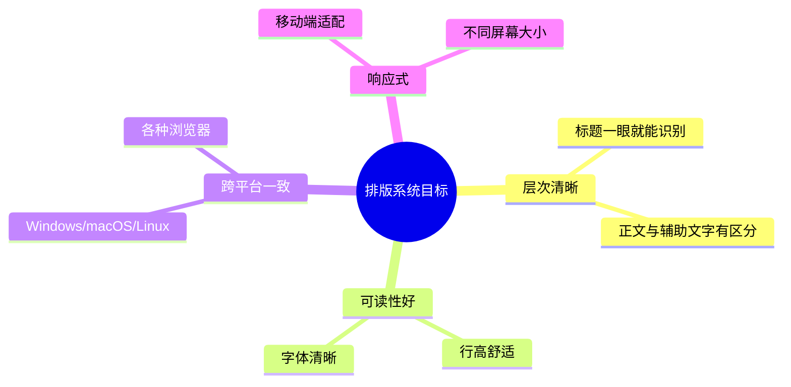
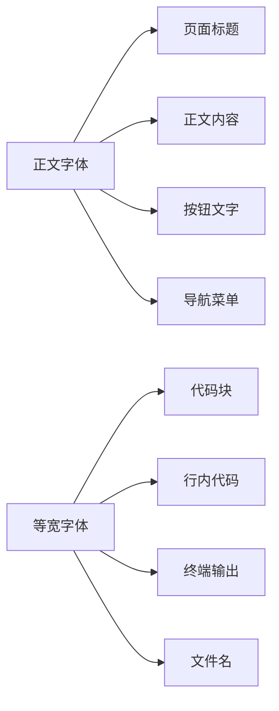
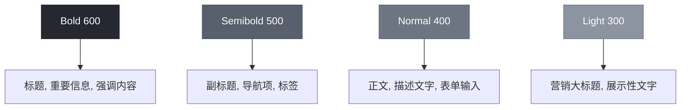
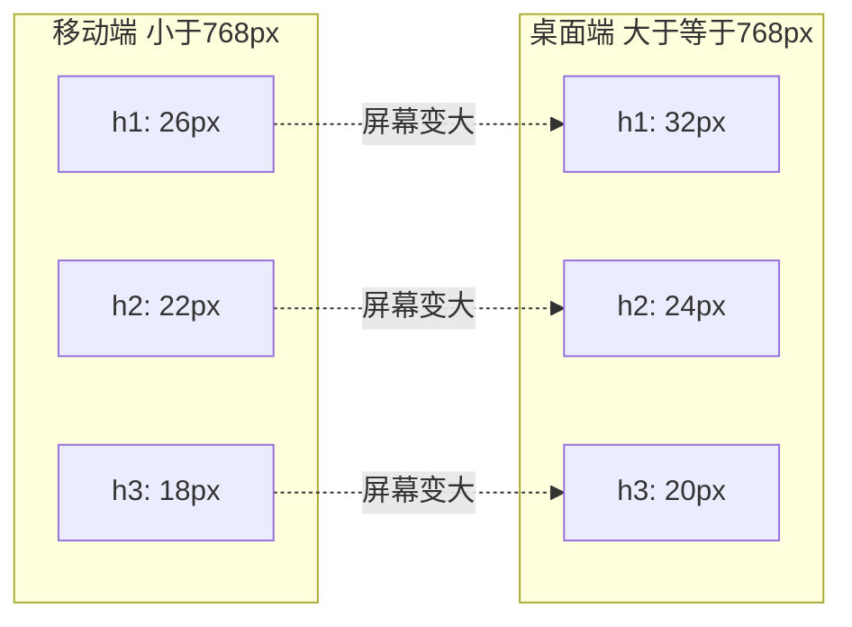

# ✍️ 第6章：排版系统

> 🧑‍💻 🎨 本章适合：前端开发者、UI 设计师

---

## 🎯 本章目标

掌握 Primer CSS 的排版系统：字体族、字号比例、行高、字重、以及响应式排版规则。

---

## 🤔 为什么排版很重要？

> 🍳 **通俗比喻**：如果网页是一本书，那排版就是"排版设计"——字号大小就是标题和正文的区分，行高就是行与行之间的"呼吸空间"，字重就是哪些内容"说话声音大"。好的排版让用户一眼就能分清主次。

### GitHub 的排版挑战

GitHub 页面包含大量文字信息：代码、README、Issue 评论、PR 描述。好的排版系统需要：



---

## 🔤 字体族（Font Family）

Primer CSS 定义了三套字体族：

### 1. 正文字体

```scss
// 系统字体栈 —— 使用操作系统的默认字体
$body-font-family:
  -apple-system,          // macOS/iOS
  BlinkMacSystemFont,     // macOS Chrome
  "Segoe UI",             // Windows
  "Noto Sans",            // Linux
  Helvetica,              // 回退
  Arial,                  // 回退
  sans-serif;             // 最终回退
```

> 💡 **为什么用系统字体栈？**
> - **性能**：不需要下载 Web 字体，零加载时间
> - **熟悉感**：用户看到的是自己系统的字体，感觉"很原生"
> - **减少 FOIT/FOUT**：不会出现字体闪烁问题
> - 这是 GitHub 2016 年的重要技术决策，后来被许多大公司效仿

### 2. 等宽字体（代码字体）

```scss
$mono-font-family:
  ui-monospace,           // 系统等宽字体
  SFMono-Regular,         // macOS
  "SF Mono",              // macOS
  Menlo,                  // macOS 回退
  Consolas,               // Windows
  "Liberation Mono",      // Linux
  monospace;              // 最终回退
```

### 3. 应用场景



```html
<!-- 正文字体（默认） -->
<p>这段文字使用正文字体</p>

<!-- 等宽字体 -->
<code class="text-mono">console.log('Hello!')</code>

<!-- 在段落中使用等宽字体 -->
<p>请运行 <code class="text-mono f6">npm install</code> 安装依赖</p>
```

---

## 📏 字号比例（Font Size Scale）

Primer CSS 定义了一套从大到小的字号比例：

### 字号变量

```scss
// 移动端字号（基础值）
$h00-size-mobile: 40px;   // f00: 展示性超大标题
$h0-size-mobile: 32px;    // f0: 落地页标题
$h1-size-mobile: 26px;    // f1: 页面标题
$h2-size-mobile: 22px;    // f2: 区域标题
$h3-size-mobile: 18px;    // f3: 小节标题
// h4 ~ h6 通常不区分移动端/桌面端
```

### 工具类对照表

| 类名 | 字号 | 使用场景 | 视觉比例 |
|------|------|---------|---------|
| `f00` | 40px | 营销页超大标题 | ████████████ |
| `f0` | 32px | 落地页主标题 | ██████████ |
| `f1` | 26px | 页面标题 | ████████ |
| `f2` | 22px | 区域/章节标题 | ███████ |
| `f3` | 18px | 小节标题 | █████ |
| `f4` | 16px | 强调文本/大正文 | ████ |
| `f5` | 14px | 默认正文 | ███ |
| `f6` | 12px | 辅助文字/注释 | ██ |

### 使用示例

```html
<h1 class="f1">页面标题（26px）</h1>
<h2 class="f2">章节标题（22px）</h2>
<h3 class="f3">小节标题（18px）</h3>
<p class="f5">正文内容（14px）—— 这是 GitHub 的默认正文大小</p>
<span class="f6 color-fg-muted">辅助文字（12px）</span>
```

### 为什么默认正文是 14px？

> 🍳 **通俗比喻**：大多数网站用 16px 作为正文大小。但 GitHub 选择了 14px，因为 GitHub 页面信息密度高——Issue 列表、代码行、文件目录。14px 让同一屏幕能显示更多信息，同时仍然保持可读性。就像报纸用比书本更小的字号——因为信息密度不同。

---

## 📐 行高（Line Height）

行高决定了文字的"呼吸感"：

```scss
$lh-condensed-ultra: 1;      // 极紧凑（用于标题）
$lh-condensed: 1.25;          // 紧凑（用于短文本）
$lh-default: 1.5;             // 默认（用于正文）
```

### 行高对比

```
行高 1.0（极紧凑）
这是第一行文字
这是第二行文字
（文字紧贴在一起，适合标题）

行高 1.25（紧凑）
这是第一行文字

这是第二行文字
（行间有少量空隙，适合列表）

行高 1.5（默认）
这是第一行文字


这是第二行文字
（行间空间充足，适合长文本阅读）
```

```html
<!-- 不同行高的应用 -->
<h1 class="lh-condensed-ultra">紧凑标题</h1>
<p class="lh-condensed">紧凑段落文字，适用于较短的内容</p>
<p class="lh-default">默认行高的段落文字，适用于正文阅读</p>
```

### 为什么正文用 1.5 行高？

> WCAG 无障碍指南建议正文行高至少为 1.5。这是经过研究的——1.5 的行高让人类眼睛更容易追踪到下一行的开头，减少"串行"现象。标题因为字号大、行数少，所以可以用更紧凑的行高。

---

## ⚖️ 字重（Font Weight）

```scss
$font-weight-bold: 600;       // 粗体
$font-weight-semibold: 500;   // 半粗体
$font-weight-normal: 400;     // 正常
$font-weight-light: 300;      // 细体
```

### 使用工具类

```html
<!-- 字重工具类 -->
<span class="text-bold">粗体文字 (600)</span>
<span class="text-semibold">半粗体文字 (500)</span>
<span class="text-normal">正常文字 (400)</span>
<span class="text-light">细体文字 (300)</span>
```

### 字重的使用原则



> 💡 注意 Primer 用 `600` 而不是 `700` 作为粗体。这是因为现代系统字体（如 SF Pro、Segoe UI）在 `600` 时的粗细视觉效果已经足够，`700` 反而会显得太粗。

---

## 📱 响应式排版

### 标题的响应式字号

Primer CSS 的大标题在移动端和桌面端有不同的字号：



> 💡 **为什么移动端字号更小？** 手机屏幕宽度只有 375px 左右，如果标题太大，一行只能显示几个字，体验很差。减小字号可以让同一行显示更多内容。但正文大小（14px）不变，因为人类阅读正文的最小舒适字号不应低于 14px。

---

## 🛠️ 排版工具类大全

### 字号类

```html
<span class="f1">26px</span>
<span class="f2">22px</span>
<span class="f3">18px</span>
<span class="f4">16px</span>
<span class="f5">14px（默认）</span>
<span class="f6">12px</span>
```

### 字重类

```html
<span class="text-bold">粗体</span>
<span class="text-semibold">半粗</span>
<span class="text-normal">正常</span>
<span class="text-light">细体</span>
```

### 对齐类

```html
<p class="text-left">左对齐</p>
<p class="text-center">居中对齐</p>
<p class="text-right">右对齐</p>
```

### 文本处理类

```html
<!-- 不换行 -->
<span class="ws-nowrap">这段文字不会换行，即使容器太窄</span>

<!-- 截断（需要限制宽度） -->
<div class="css-truncate css-truncate-overflow" style="max-width: 200px;">
  这是一段很长很长的文字会被截断显示省略号
</div>

<!-- 等宽字体 -->
<code class="text-mono">const x = 42;</code>

<!-- 大写 -->
<span class="text-uppercase">uppercase text</span>
```

---

## 📋 实战：文章排版

```html
<!-- GitHub 风格的文章排版 -->
<article class="markdown-body p-4" style="max-width: 800px;">
  <h1 class="f1 text-bold lh-condensed mb-2">
    使用 Primer CSS 构建设计系统
  </h1>
  <div class="d-flex flex-items-center mb-4">
    
    <span class="text-bold f5">作者名</span>
    <span class="color-fg-muted f6 ml-2">· 2024年1月1日</span>
  </div>

  <p class="f4 color-fg-muted mb-4">
    本文将介绍如何从零开始使用 Primer CSS 构建一个完整的设计系统。
  </p>

  <h2 class="f2 text-bold lh-condensed mb-2 mt-4">什么是设计系统？</h2>
  <p class="f5 lh-default mb-3">
    设计系统是一套完整的标准，包含文档和原则，
    配合工具包和组件来实现这些标准。
  </p>

  <h3 class="f3 text-bold lh-condensed mb-2 mt-3">核心组件</h3>
  <p class="f5 lh-default mb-3">
    以下是设计系统中最重要的组件...
  </p>

  <pre class="p-3 color-bg-subtle rounded-2 mb-3">
    <code class="text-mono f6">npm install @primer/css</code>
  </pre>

  <p class="f6 color-fg-muted">
    📝 提示：建议使用 npm 7+ 版本以获得最佳兼容性。
  </p>
</article>
```

---

## 🎓 本章小结

| 概念 | 说明 |
|------|------|
| 字体族 | 系统字体栈（无需加载 Web 字体） |
| 字号比例 | f00(40px) → f6(12px)，共 8 个等级 |
| 默认正文 | 14px（比通常的 16px 小，适合信息密集页面） |
| 行高 | 1.0/1.25/1.5 三个级别 |
| 字重 | 300/400/500/600 四个级别 |
| 等宽字体 | 用于代码显示 |
| 响应式 | 大标题在移动端自动缩小 |

### 排版速查

```
字号: f1 f2 f3 f4 f5 f6
字重: text-bold text-semibold text-normal text-light
行高: lh-condensed-ultra lh-condensed lh-default
对齐: text-left text-center text-right
字体: text-mono
```

---

**上一章** 👈 [第5章：颜色系统与主题](./05-color-system.md)

**下一章** 👉 [第7章：布局与间距](./07-layout.md)
