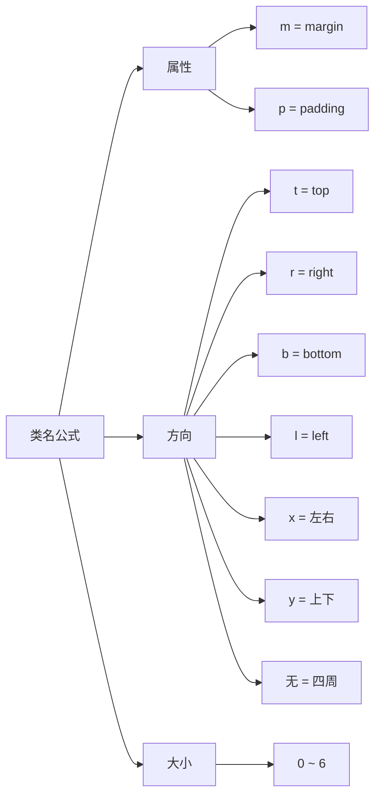
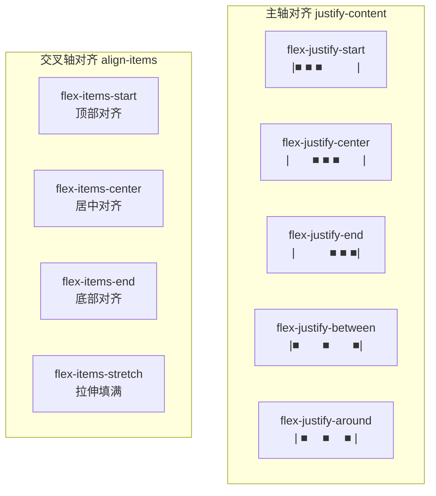
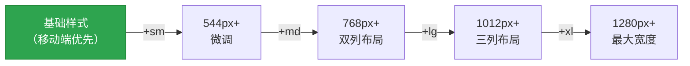

# 📐 第7章：布局与间距

> 🧑‍💻 🎨 本章适合：前端开发者、UI 设计师

---

## 🎯 本章目标

掌握 Primer CSS 的布局系统：间距规则、Flexbox 布局工具类、响应式断点、以及常用布局模式。

---

## 📏 间距系统

### 8px 基础网格

Primer CSS 的间距系统基于 **4px 增量**，形成统一的间距刻度：

```
$spacer-0: 0px     █  无间距
$spacer-1: 4px     █▏  极小
$spacer-2: 8px     █▎  小
$spacer-3: 16px    █▍  标准
$spacer-4: 24px    █▌  中等
$spacer-5: 32px    █▋  大
$spacer-6: 40px    █▊  极大
```

> 🍳 **通俗比喻**：间距系统就像音乐的音阶——do、re、mi、fa、sol、la、si。你不会用 "do 和 re 之间的音"，因为那听起来不和谐。同样，你不应该用 `margin: 13px`，因为它不在 Primer 的"音阶"上。

### 间距工具类

#### Margin（外边距）

```html
<!-- 四周 margin -->
<div class="m-0">margin: 0</div>
<div class="m-1">margin: 4px</div>
<div class="m-2">margin: 8px</div>
<div class="m-3">margin: 16px</div>
<div class="m-4">margin: 24px</div>
<div class="m-5">margin: 32px</div>
<div class="m-6">margin: 40px</div>

<!-- 单方向 margin -->
<div class="mt-3">margin-top: 16px</div>
<div class="mr-3">margin-right: 16px</div>
<div class="mb-3">margin-bottom: 16px</div>
<div class="ml-3">margin-left: 16px</div>

<!-- 双方向 margin -->
<div class="mx-3">margin-left + margin-right: 16px</div>
<div class="my-3">margin-top + margin-bottom: 16px</div>

<!-- 自动居中 -->
<div class="mx-auto" style="width: 200px;">水平居中</div>

<!-- 负数 margin（用于特殊布局） -->
<div class="mt-n3">margin-top: -16px</div>
```

#### Padding（内边距）

```html
<!-- 四周 padding -->
<div class="p-0">padding: 0</div>
<div class="p-3">padding: 16px</div>
<div class="p-6">padding: 40px</div>

<!-- 单方向 padding -->
<div class="pt-3">padding-top: 16px</div>
<div class="pr-3">padding-right: 16px</div>
<div class="pb-3">padding-bottom: 16px</div>
<div class="pl-3">padding-left: 16px</div>

<!-- 双方向 padding -->
<div class="px-3">padding-left + padding-right: 16px</div>
<div class="py-3">padding-top + padding-bottom: 16px</div>
```

### 间距命名规律



```
{属性}{方向}-{大小}

例如：
mt-3 = margin-top: 16px
px-2 = padding-left: 8px; padding-right: 8px
m-4  = margin: 24px (四周)
```

---

## 📦 Display（显示方式）

```html
<!-- 基础显示 -->
<div class="d-block">块级元素</div>
<span class="d-inline">行内元素</span>
<span class="d-inline-block">行内块元素</span>
<div class="d-none">隐藏元素</div>
<div class="d-flex">Flex 容器</div>
<div class="d-inline-flex">行内 Flex 容器</div>
<div class="d-table">表格布局</div>
```

---

## 🧘 Flexbox 布局

Flexbox 是 Primer CSS 的核心布局方式。

### 基础用法

```html
<!-- 水平排列（默认） -->
<div class="d-flex">
  <div>项目 1</div>
  <div>项目 2</div>
  <div>项目 3</div>
</div>

<!-- 垂直排列 -->
<div class="d-flex flex-column">
  <div>项目 1</div>
  <div>项目 2</div>
  <div>项目 3</div>
</div>
```

### 对齐方式



```html
<!-- 水平+垂直居中 -->
<div class="d-flex flex-justify-center flex-items-center" style="height: 200px;">
  <span>我被居中了！</span>
</div>

<!-- 两端对齐 -->
<div class="d-flex flex-justify-between flex-items-center">
  <span>左边</span>
  <span>右边</span>
</div>

<!-- 底部对齐 -->
<div class="d-flex flex-items-end" style="height: 100px;">
  <span>底部</span>
</div>
```

### Flex 项目属性

```html
<!-- 自动填充剩余空间 -->
<div class="d-flex">
  <div>固定宽度</div>
  <div class="flex-auto">自动填满 ← 占据所有剩余空间</div>
  <div>固定宽度</div>
</div>

<!-- 防止收缩 -->
<div class="d-flex">
  <div class="flex-shrink-0">不会被压缩</div>
  <div class="flex-auto">可以被压缩的内容...</div>
</div>

<!-- 自动间距 -->
<div class="d-flex">
  <div>左边</div>
  <div class="ml-auto">被推到右边 ← margin-left: auto</div>
</div>

<!-- 排列顺序 -->
<div class="d-flex">
  <div class="flex-order-2">视觉上第二</div>
  <div class="flex-order-1">视觉上第一</div>
</div>
```

### 换行控制

```html
<!-- 允许换行 -->
<div class="d-flex flex-wrap">
  <div class="m-1 p-2 border">项目 1</div>
  <div class="m-1 p-2 border">项目 2</div>
  <div class="m-1 p-2 border">项目 3</div>
  <!-- 容器不够宽时自动换行 -->
</div>

<!-- 间距控制 -->
<div class="d-flex gap-2">
  <div>项目 1</div>
  <div>项目 2</div>
  <div>项目 3</div>
</div>
```

---

## 📱 响应式断点

Primer CSS 定义了以下断点：

| 断点 | 宽度范围 | 后缀 | 常见设备 |
|------|---------|------|---------|
| 无后缀 | 所有宽度 | - | 全部 |
| `sm` | ≥ 544px | `-sm` | 大手机/小平板 |
| `md` | ≥ 768px | `-md` | 平板 |
| `lg` | ≥ 1012px | `-lg` | 笔记本 |
| `xl` | ≥ 1280px | `-xl` | 桌面显示器 |

### 响应式工具类用法

```html
<!-- 移动端堆叠，桌面端水平排列 -->
<div class="d-flex flex-column flex-md-row">
  <div class="col-12 col-md-6">左列</div>
  <div class="col-12 col-md-6">右列</div>
</div>

<!-- 移动端显示，桌面端隐藏 -->
<div class="d-block d-md-none">仅移动端可见</div>

<!-- 移动端隐藏，桌面端显示 -->
<div class="d-none d-md-block">仅桌面端可见</div>

<!-- 响应式间距 -->
<div class="p-2 p-md-4 p-lg-6">
  移动端 p-2(8px)，平板 p-4(24px)，桌面 p-6(40px)
</div>

<!-- 响应式文字对齐 -->
<p class="text-center text-md-left">
  移动端居中，桌面端左对齐
</p>
```

### 响应式设计原则：Mobile First



> 🍳 **通俗比喻**：Mobile First 就像穿衣服——先穿好基础的（移动端样式），然后根据天气（屏幕大小）往上加外套、围巾。而不是先穿一身厚棉袄（桌面端样式），到了热天再一件件脱（用 max-width 覆盖）。

---

## 🏗️ 常用布局模式

### 模式1：页头 + 内容 + 页脚

```html
<div class="d-flex flex-column" style="min-height: 100vh;">
  <!-- 页头 -->
  <header class="Header p-3">
    <div class="Header-item">
      <a href="/" class="text-bold color-fg-default">Logo</a>
    </div>
    <div class="Header-item Header-item--full">
      <!-- 导航项 -->
    </div>
  </header>

  <!-- 内容（flex-auto 让它填满剩余空间） -->
  <main class="flex-auto p-4">
    <div class="mx-auto" style="max-width: 1012px;">
      内容区域
    </div>
  </main>

  <!-- 页脚 -->
  <footer class="p-4 color-bg-subtle text-center color-fg-muted f6">
    © 2024 我的网站
  </footer>
</div>
```

### 模式2：侧边栏 + 主内容

```html
<div class="d-flex flex-column flex-md-row">
  <!-- 侧边栏 -->
  <aside class="col-12 col-md-3 p-3 color-bg-subtle">
    <nav>
      <a class="d-block py-1 color-fg-default" href="#">导航 1</a>
      <a class="d-block py-1 color-fg-default" href="#">导航 2</a>
      <a class="d-block py-1 color-fg-default" href="#">导航 3</a>
    </nav>
  </aside>

  <!-- 主内容 -->
  <main class="col-12 col-md-9 p-4">
    <h1 class="f2 text-bold mb-3">页面标题</h1>
    <p>页面内容...</p>
  </main>
</div>
```

### 模式3：卡片网格

```html
<div class="d-flex flex-wrap gap-3 p-3">
  <!-- 卡片（响应式宽度） -->
  <div class="Box p-3 col-12 col-md-5 col-lg-3">
    <h3 class="f4 text-bold mb-2">卡片 1</h3>
    <p class="color-fg-muted f5">描述信息</p>
  </div>

  <div class="Box p-3 col-12 col-md-5 col-lg-3">
    <h3 class="f4 text-bold mb-2">卡片 2</h3>
    <p class="color-fg-muted f5">描述信息</p>
  </div>

  <div class="Box p-3 col-12 col-md-5 col-lg-3">
    <h3 class="f4 text-bold mb-2">卡片 3</h3>
    <p class="color-fg-muted f5">描述信息</p>
  </div>
</div>
```

### 模式4：居中内容

```html
<!-- 水平 + 垂直居中 -->
<div class="d-flex flex-justify-center flex-items-center" style="min-height: 100vh;">
  <div class="Box p-6 text-center" style="max-width: 400px;">
    <h1 class="f2 text-bold mb-2">欢迎 👋</h1>
    <p class="color-fg-muted mb-4">请登录以继续</p>
    <button class="btn btn-primary btn-block">登录</button>
  </div>
</div>
```

---

## 📊 列宽系统

Primer CSS 提供 12 列网格的宽度工具类：

```html
<div class="d-flex flex-wrap">
  <div class="col-12">100% 宽度</div>
  <div class="col-6">50% 宽度</div>
  <div class="col-6">50% 宽度</div>
  <div class="col-4">33.3% 宽度</div>
  <div class="col-4">33.3% 宽度</div>
  <div class="col-4">33.3% 宽度</div>
  <div class="col-3">25% 宽度</div>
  <div class="col-9">75% 宽度</div>
</div>
```

可用的列宽：`col-1` 到 `col-12`

---

## 🎓 本章小结

| 概念 | 说明 |
|------|------|
| 间距刻度 | 0/4/8/16/24/32/40px（$spacer-0 到 $spacer-6） |
| 间距类名 | `{m/p}{t/r/b/l/x/y}-{0-6}` |
| Flexbox | `d-flex` + 对齐 + 方向 + 换行 |
| 断点 | sm(544)/md(768)/lg(1012)/xl(1280) |
| Mobile First | 先写移动端，再用断点后缀添加桌面端样式 |
| 列宽 | `col-1` 到 `col-12`，12 列网格 |

### 布局速查

```
间距:     m-{0-6}  p-{0-6}  mt-3  px-2  mx-auto
显示:     d-flex  d-block  d-none  d-inline
方向:     flex-column  flex-row  flex-column-reverse
对齐:     flex-justify-{start|center|end|between|around}
          flex-items-{start|center|end|stretch}
弹性:     flex-auto  flex-shrink-0  flex-grow-0
换行:     flex-wrap  flex-nowrap
列宽:     col-{1-12}
响应式:   d-md-flex  p-lg-4  col-md-6
```

---

**上一章** 👈 [第6章：排版系统](./06-typography.md)

**下一章** 👉 [第8章：核心组件详解](./08-components.md)
