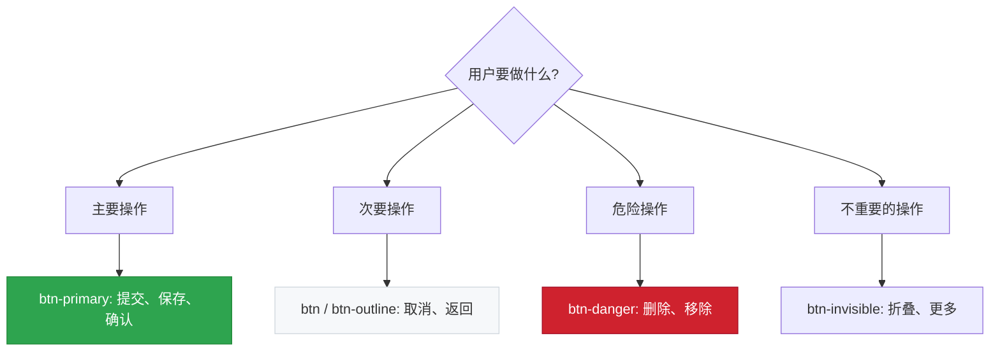
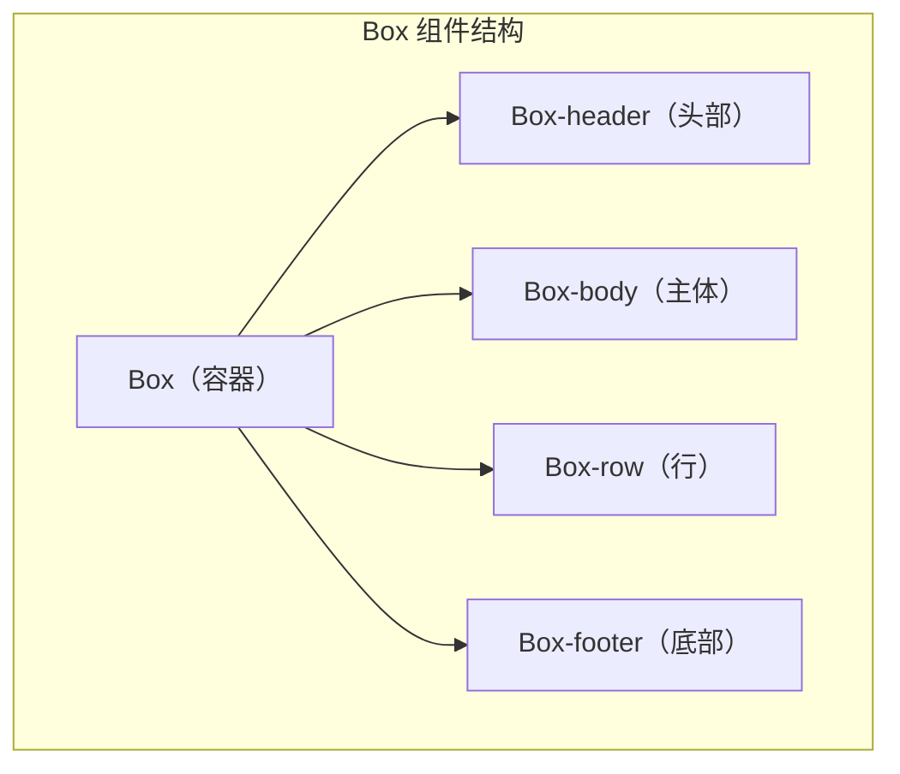
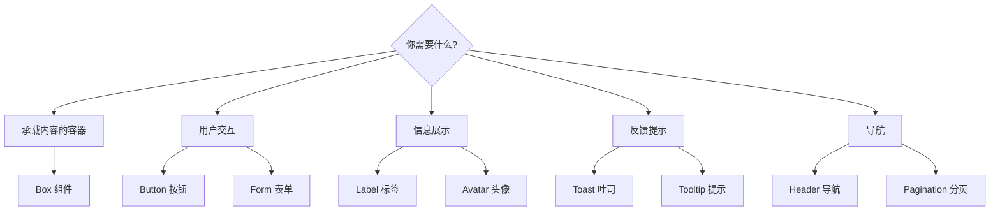

# 🧩 第8章：核心组件详解

> 🧑‍💻 🎨 本章适合：前端开发者、UI 设计师

---

## 🎯 本章目标

详细学习 Primer CSS 中最常用的 UI 组件：按钮、表单、Box、标签、头像、导航、吐司消息、工具提示等。

---

## 🔘 按钮（Buttons）

按钮是最基础也是最常用的交互组件。

### 基础按钮

```html
<!-- 默认按钮 -->
<button class="btn" type="button">默认按钮</button>

<!-- 主要按钮（绿色） -->
<button class="btn btn-primary" type="button">主要按钮</button>

<!-- 轮廓按钮（蓝色边框） -->
<button class="btn btn-outline" type="button">轮廓按钮</button>

<!-- 危险按钮（红色） -->
<button class="btn btn-danger" type="button">危险按钮</button>

<!-- 隐形按钮（无边框） -->
<button class="btn btn-invisible" type="button">隐形按钮</button>
```

### 按钮尺寸

```html
<button class="btn btn-sm" type="button">小按钮</button>
<button class="btn" type="button">默认大小</button>
<button class="btn btn-large" type="button">大按钮</button>
<button class="btn btn-block" type="button">全宽按钮</button>
```

### 按钮的设计逻辑



> 🍳 **通俗比喻**：按钮类型就像交通信号——绿色（primary）说"来吧"，灰色（default）说"可以走"，红色（danger）说"小心！"。一个页面通常只有一个绿色按钮，就像十字路口同时只有一个方向是绿灯。

### 按钮组

```html
<div class="BtnGroup">
  <button class="BtnGroup-item btn" type="button">左</button>
  <button class="BtnGroup-item btn" type="button">中</button>
  <button class="BtnGroup-item btn" type="button">右</button>
</div>
```

### 按钮状态

```html
<!-- 禁用状态 -->
<button class="btn" disabled>禁用按钮</button>

<!-- 计数器 -->
<button class="btn" type="button">
  关注
  <span class="Counter">12</span>
</button>
```

---

## 📝 表单（Forms）

### 基础输入框

```html
<!-- 文本输入 -->
<input class="form-control" type="text" placeholder="请输入用户名">

<!-- 大输入框 -->
<input class="form-control input-lg" type="text" placeholder="大输入框">

<!-- 小输入框 -->
<input class="form-control input-sm" type="text" placeholder="小输入框">

<!-- 全宽输入框 -->
<input class="form-control input-block" type="text" placeholder="全宽输入框">
```

### 表单组

```html
<div class="form-group">
  <div class="form-group-header">
    <label for="username">用户名</label>
  </div>
  <div class="form-group-body">
    <input class="form-control" type="text" id="username" placeholder="输入用户名">
  </div>
</div>

<div class="form-group">
  <div class="form-group-header">
    <label for="bio">个人简介</label>
  </div>
  <div class="form-group-body">
    <textarea class="form-control" id="bio" rows="3" placeholder="介绍一下自己"></textarea>
  </div>
</div>
```

### 下拉选择

```html
<select class="form-select">
  <option>请选择语言</option>
  <option>JavaScript</option>
  <option>TypeScript</option>
  <option>Python</option>
  <option>Go</option>
</select>
```

### 复选框和单选框

```html
<!-- 复选框 -->
<div class="form-checkbox">
  <label>
    <input type="checkbox">
    我同意服务条款
  </label>
</div>

<!-- 单选框 -->
<div class="form-group">
  <label class="d-block mb-1">
    <input type="radio" name="plan" checked> 免费版
  </label>
  <label class="d-block mb-1">
    <input type="radio" name="plan"> 专业版
  </label>
  <label class="d-block">
    <input type="radio" name="plan"> 企业版
  </label>
</div>
```

### 表单验证状态

```html
<!-- 错误状态 -->
<div class="form-group errored">
  <div class="form-group-header">
    <label>邮箱</label>
  </div>
  <div class="form-group-body">
    <input class="form-control" type="email" value="invalid-email">
    <p class="note error">请输入有效的邮箱地址</p>
  </div>
</div>

<!-- 成功状态 -->
<div class="form-group successed">
  <div class="form-group-header">
    <label>用户名</label>
  </div>
  <div class="form-group-body">
    <input class="form-control" type="text" value="octocat">
    <p class="note success">用户名可用 ✅</p>
  </div>
</div>
```

---

## 📦 Box（盒子组件）

Box 是 Primer 中最通用的容器组件。

### 基础 Box

```html
<!-- 简单的 Box -->
<div class="Box">
  <div class="Box-body">
    这是一个基础盒子
  </div>
</div>

<!-- 带头部的 Box -->
<div class="Box">
  <div class="Box-header">
    <h3 class="Box-title">标题</h3>
  </div>
  <div class="Box-body">
    内容区域
  </div>
</div>
```

### Box 结构



### 列表式 Box

```html
<!-- Issue 列表风格 -->
<div class="Box">
  <div class="Box-header">
    <h3 class="Box-title">最近的 Issues</h3>
  </div>
  <div class="Box-row d-flex flex-items-center">
    <span class="color-fg-success mr-2">●</span>
    <a href="#" class="color-fg-default text-bold flex-auto">修复登录页面 Bug</a>
    <span class="Label Label--secondary">bug</span>
  </div>
  <div class="Box-row d-flex flex-items-center">
    <span class="color-fg-success mr-2">●</span>
    <a href="#" class="color-fg-default text-bold flex-auto">添加暗黑模式支持</a>
    <span class="Label Label--primary">feature</span>
  </div>
  <div class="Box-row d-flex flex-items-center">
    <span class="color-fg-danger mr-2">●</span>
    <a href="#" class="color-fg-default text-bold flex-auto">性能优化</a>
    <span class="Label Label--attention">performance</span>
  </div>
</div>
```

### 蓝色提示 Box

```html
<div class="Box color-border-accent-emphasis color-bg-accent-subtle p-3">
  <div class="d-flex flex-items-center">
    <span class="mr-2">💡</span>
    <span class="color-fg-default">提示：你可以使用快捷键 <kbd>Ctrl+K</kbd> 快速搜索</span>
  </div>
</div>
```

---

## 🏷️ 标签（Labels）

### 基础标签

```html
<!-- 默认标签 -->
<span class="Label">默认</span>

<!-- 语义化标签 -->
<span class="Label Label--primary">主要</span>
<span class="Label Label--secondary">次要</span>
<span class="Label Label--accent">强调</span>
<span class="Label Label--success">成功</span>
<span class="Label Label--attention">注意</span>
<span class="Label Label--severe">严重</span>
<span class="Label Label--danger">危险</span>
<span class="Label Label--done">完成</span>
<span class="Label Label--sponsors">赞助</span>
```

### 标签尺寸

```html
<span class="Label Label--large Label--primary">大标签</span>
<span class="Label Label--primary">默认标签</span>
```

### GitHub 标签实战

```html
<!-- 模拟 GitHub Issue 标签 -->
<div class="d-flex flex-wrap gap-1">
  <span class="Label" style="background-color: #d73a4a; color: #fff;">bug</span>
  <span class="Label" style="background-color: #0075ca; color: #fff;">documentation</span>
  <span class="Label" style="background-color: #cfd3d7;">duplicate</span>
  <span class="Label" style="background-color: #a2eeef;">enhancement</span>
  <span class="Label" style="background-color: #7057ff; color: #fff;">good first issue</span>
</div>
```

---

## 👤 头像（Avatars）

### 基础头像

```html
<!-- 不同大小的头像 -->


```

### 头像组（显示多个贡献者）

```html
<div class="AvatarStack AvatarStack--three-plus">
  <div class="AvatarStack-body">
    
    
    
  </div>
</div>
```

---

## 🧭 导航（Navigation）

### Header 导航

```html
<header class="Header">
  <div class="Header-item">
    <a href="/" class="Header-link f4 d-flex flex-items-center">
      🐙 Logo
    </a>
  </div>
  <div class="Header-item Header-item--full">
    <!-- 占据剩余空间 -->
  </div>
  <div class="Header-item mr-0">
    
  </div>
</header>
```

### 分页导航

```html
<nav class="paginate-container" aria-label="分页">
  <div class="pagination">
    <span class="previous_page disabled">上一页</span>
    <a href="#" class="current" aria-current="page">1</a>
    <a href="#">2</a>
    <a href="#">3</a>
    <a href="#" class="next_page">下一页</a>
  </div>
</nav>
```

---

## 🍞 吐司消息（Toasts）

```html
<!-- 默认吐司 -->
<div class="Toast">
  <span class="Toast-icon">ℹ️</span>
  <span class="Toast-content">这是一条通知消息</span>
</div>

<!-- 成功吐司 -->
<div class="Toast Toast--success">
  <span class="Toast-icon">✅</span>
  <span class="Toast-content">操作成功完成！</span>
</div>

<!-- 警告吐司 -->
<div class="Toast Toast--warning">
  <span class="Toast-icon">⚠️</span>
  <span class="Toast-content">请注意这个重要信息</span>
</div>

<!-- 错误吐司 -->
<div class="Toast Toast--error">
  <span class="Toast-icon">❌</span>
  <span class="Toast-content">操作失败，请重试</span>
</div>
```

---

## 💬 工具提示（Tooltips）

```html
<!-- 上方提示 -->
<span class="tooltipped tooltipped-n" aria-label="这是提示文字">
  悬停查看提示（上方）
</span>

<!-- 下方提示 -->
<span class="tooltipped tooltipped-s" aria-label="这是提示文字">
  悬停查看提示（下方）
</span>

<!-- 左侧提示 -->
<span class="tooltipped tooltipped-w" aria-label="这是提示文字">
  悬停查看提示（左侧）
</span>

<!-- 右侧提示 -->
<span class="tooltipped tooltipped-e" aria-label="这是提示文字">
  悬停查看提示（右侧）
</span>
```

> 💡 注意：Tooltip 使用 `aria-label` 属性而不是子元素来定义提示文字，这是为了**无障碍**——屏幕阅读器也能读到提示内容。

---

## 🔄 加载器（Loaders）

```html
<!-- 动画加载指示器 -->
<span class="AnimatedEllipsis">加载中</span>
```

---

## 📊 组件选择指南



---

## 🎓 本章小结

| 组件 | 主要类名 | 使用场景 |
|------|---------|---------|
| 按钮 | `.btn`, `.btn-primary` | 用户操作触发 |
| 表单 | `.form-control`, `.form-group` | 数据输入 |
| Box | `.Box`, `.Box-header`, `.Box-row` | 内容容器 |
| 标签 | `.Label`, `.Label--primary` | 分类标记 |
| 头像 | `.avatar`, `.AvatarStack` | 用户展示 |
| 导航 | `.Header`, `.pagination` | 页面导航 |
| 吐司 | `.Toast`, `.Toast--success` | 操作反馈 |
| 提示 | `.tooltipped`, `.tooltipped-n` | 信息补充 |

---

**上一章** 👈 [第7章：布局与间距](./07-layout.md)

**下一章** 👉 [第9章：工具类（Utility Classes）](./09-utilities.md)
