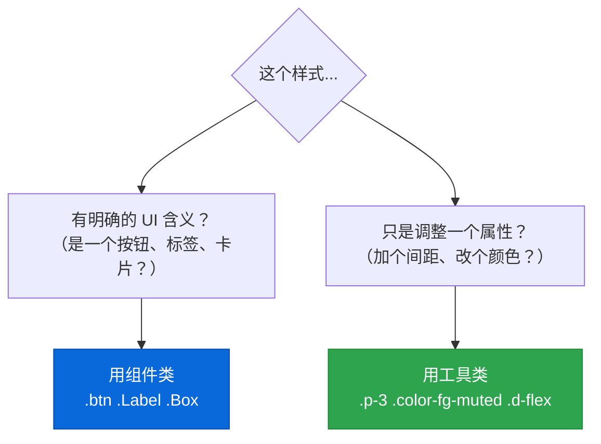
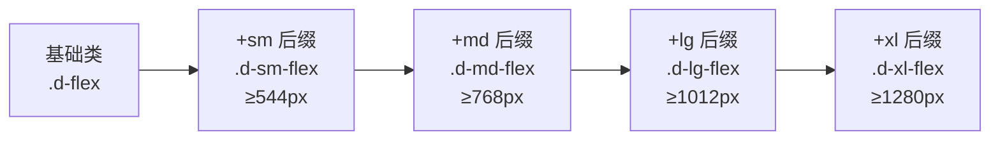

# 🔧 第9章：工具类（Utility Classes）

> 🧑‍💻 本章适合：前端开发者

---

## 🎯 本章目标

深入理解 Primer CSS 的工具类系统：设计理念、命名规则、常用类大全、以及什么时候该用组件、什么时候该用工具类。

---

## 🤔 什么是工具类？

**工具类（Utility Classes）** 是只做一件事的 CSS 类。每个类只设置一个 CSS 属性。

```css
/* 工具类 = 一个类，一个属性 */
.d-flex     { display: flex; }
.text-bold  { font-weight: 600; }
.color-fg-muted { color: var(--fgColor-muted); }
.p-3        { padding: 16px; }
.mt-2       { margin-top: 8px; }
.rounded-2  { border-radius: 6px; }
```

> 🍳 **通俗比喻**：如果组件是"预制菜"（开袋即食），那工具类就是"调味料"（盐、胡椒、酱油）。预制菜适合大多数场景，但有时候你需要加点盐、加点胡椒——这就是工具类的作用。

---

## 📐 工具类 vs 组件类

### 什么时候用组件？什么时候用工具类？



### 实际对比

```html
<!-- ✅ 组件 + 工具类配合使用 -->
<button class="btn btn-primary mr-2">保存</button>
<!--     ↑ 组件类          ↑ 工具类（加右间距） -->

<div class="Box p-4 mt-3">
<!-- ↑ 组件类  ↑ 工具类（内边距 + 上间距） -->
  <h3 class="f3 text-bold mb-2">标题</h3>
  <!-- ↑ 工具类（字号 + 字重 + 下间距） -->
  <p class="color-fg-muted f5">描述</p>
  <!-- ↑ 工具类（颜色 + 字号） -->
</div>
```

---

## 📖 工具类完整分类

### 1. 显示（Display）

```html
<div class="d-block">块级</div>
<span class="d-inline">行内</span>
<span class="d-inline-block">行内块</span>
<div class="d-flex">弹性布局</div>
<div class="d-inline-flex">行内弹性布局</div>
<div class="d-none">隐藏</div>
<div class="d-table">表格布局</div>
<div class="d-table-cell">表格单元格</div>
```

### 2. 弹性布局（Flexbox）

```html
<!-- 方向 -->
<div class="d-flex flex-row">水平</div>
<div class="d-flex flex-column">垂直</div>
<div class="d-flex flex-row-reverse">反向水平</div>
<div class="d-flex flex-column-reverse">反向垂直</div>

<!-- 主轴对齐 -->
<div class="d-flex flex-justify-start">起始</div>
<div class="d-flex flex-justify-center">居中</div>
<div class="d-flex flex-justify-end">末尾</div>
<div class="d-flex flex-justify-between">两端</div>
<div class="d-flex flex-justify-around">环绕</div>

<!-- 交叉轴对齐 -->
<div class="d-flex flex-items-start">顶部</div>
<div class="d-flex flex-items-center">居中</div>
<div class="d-flex flex-items-end">底部</div>
<div class="d-flex flex-items-baseline">基线</div>
<div class="d-flex flex-items-stretch">拉伸</div>

<!-- 换行 -->
<div class="d-flex flex-wrap">换行</div>
<div class="d-flex flex-nowrap">不换行</div>

<!-- 弹性项目 -->
<div class="flex-auto">自动填充</div>
<div class="flex-shrink-0">不收缩</div>
<div class="flex-grow-0">不增长</div>
<div class="flex-order-1">排序 1</div>
<div class="flex-order-2">排序 2</div>

<!-- 自对齐 -->
<div class="flex-self-auto">自动</div>
<div class="flex-self-start">顶部</div>
<div class="flex-self-center">居中</div>
<div class="flex-self-end">底部</div>
<div class="flex-self-stretch">拉伸</div>
```

### 3. 间距（Spacing）

```html
<!-- Margin: m{方向}-{0-6} -->
<div class="m-3">四周 margin 16px</div>
<div class="mt-3">上 margin 16px</div>
<div class="mr-3">右 margin 16px</div>
<div class="mb-3">下 margin 16px</div>
<div class="ml-3">左 margin 16px</div>
<div class="mx-3">左右 margin 16px</div>
<div class="my-3">上下 margin 16px</div>
<div class="mx-auto">水平居中</div>

<!-- 负 Margin -->
<div class="mt-n1">上 margin -4px</div>
<div class="mt-n3">上 margin -16px</div>

<!-- Padding: p{方向}-{0-6} -->
<div class="p-3">四周 padding 16px</div>
<div class="pt-3">上 padding 16px</div>
<div class="px-3">左右 padding 16px</div>
<div class="py-3">上下 padding 16px</div>

<!-- 响应式间距 -->
<div class="p-2 p-md-4 p-lg-6">响应式 padding</div>
```

### 4. 颜色（Colors）

```html
<!-- 文字颜色 -->
<span class="color-fg-default">默认文字</span>
<span class="color-fg-muted">次要文字</span>
<span class="color-fg-subtle">微弱文字</span>
<span class="color-fg-accent">强调文字</span>
<span class="color-fg-success">成功文字</span>
<span class="color-fg-attention">注意文字</span>
<span class="color-fg-danger">危险文字</span>
<span class="color-fg-on-emphasis">强调背景上的文字</span>

<!-- 背景颜色 -->
<div class="color-bg-default">默认背景</div>
<div class="color-bg-subtle">次要背景</div>
<div class="color-bg-emphasis color-fg-on-emphasis">强调背景</div>
<div class="color-bg-accent-emphasis color-fg-on-emphasis">蓝色背景</div>
<div class="color-bg-success-emphasis color-fg-on-emphasis">绿色背景</div>
<div class="color-bg-danger-emphasis color-fg-on-emphasis">红色背景</div>

<!-- 边框颜色 -->
<div class="border color-border-default">默认边框</div>
<div class="border color-border-muted">次要边框</div>
<div class="border color-border-accent-emphasis">蓝色边框</div>
```

### 5. 排版（Typography）

```html
<!-- 字号 -->
<span class="f1">26px</span>
<span class="f2">22px</span>
<span class="f3">18px</span>
<span class="f4">16px</span>
<span class="f5">14px</span>
<span class="f6">12px</span>

<!-- 字重 -->
<span class="text-bold">粗体</span>
<span class="text-semibold">半粗</span>
<span class="text-normal">正常</span>
<span class="text-light">细体</span>

<!-- 行高 -->
<p class="lh-condensed-ultra">极紧凑行高 (1)</p>
<p class="lh-condensed">紧凑行高 (1.25)</p>
<p class="lh-default">默认行高 (1.5)</p>

<!-- 对齐 -->
<p class="text-left">左对齐</p>
<p class="text-center">居中</p>
<p class="text-right">右对齐</p>

<!-- 文字样式 -->
<span class="text-mono">等宽字体</span>
<span class="text-uppercase">大写</span>
<span class="ws-nowrap">不换行</span>
<span class="text-underline">下划线</span>
```

### 6. 边框（Borders）

```html
<!-- 边框 -->
<div class="border">四周边框</div>
<div class="border-top">上边框</div>
<div class="border-right">右边框</div>
<div class="border-bottom">下边框</div>
<div class="border-left">左边框</div>
<div class="border-0">无边框</div>

<!-- 圆角 -->
<div class="rounded-0">无圆角</div>
<div class="rounded-1">小圆角 (4px)</div>
<div class="rounded-2">中圆角 (6px)</div>
<div class="rounded-3">大圆角 (8px)</div>
<div class="circle">圆形</div>
```

### 7. 阴影（Box Shadow）

```html
<div class="box-shadow-none">无阴影</div>
<div class="box-shadow-small">小阴影</div>
<div class="box-shadow-medium">中阴影</div>
<div class="box-shadow-large">大阴影</div>
<div class="box-shadow-extra-large">超大阴影</div>
```

### 8. 可见性（Visibility）

```html
<div class="v-hidden">不可见（占位）</div>
<div class="v-visible">可见</div>
<div class="d-none">隐藏（不占位）</div>

<!-- 仅屏幕阅读器可见（无障碍） -->
<span class="sr-only">仅屏幕阅读器可读</span>

<!-- 响应式显示/隐藏 -->
<div class="d-none d-md-block">仅桌面端显示</div>
<div class="d-block d-md-none">仅移动端显示</div>
```

### 9. 定位（Position）

```html
<div class="position-relative">相对定位</div>
<div class="position-absolute">绝对定位</div>
<div class="position-fixed">固定定位</div>
<div class="position-sticky">粘性定位</div>

<!-- 位置 -->
<div class="top-0">顶部</div>
<div class="right-0">右侧</div>
<div class="bottom-0">底部</div>
<div class="left-0">左侧</div>
```

### 10. 动画（Animations）

```html
<div class="anim-fade-in">淡入</div>
<div class="anim-fade-out">淡出</div>
<div class="anim-fade-up">向上淡入</div>
<div class="anim-fade-down">向下淡入</div>
<div class="anim-scale-in">缩放进入</div>
<div class="anim-grow-x">水平增长</div>
<div class="anim-pulse">脉动</div>
```

---

## 🎯 响应式工具类

几乎所有工具类都支持响应式后缀：

```html
<!-- 显示 -->
<div class="d-none d-md-flex">平板及以上显示为 flex</div>

<!-- 方向 -->
<div class="d-flex flex-column flex-md-row">移动端垂直，平板水平</div>

<!-- 间距 -->
<div class="p-2 p-md-4 p-lg-6">响应式内边距</div>

<!-- 对齐 -->
<p class="text-center text-md-left">移动端居中，桌面端左对齐</p>

<!-- 宽度 -->
<div class="col-12 col-md-6 col-lg-4">响应式宽度</div>
```

### 响应式后缀规则



---

## 💡 工具类使用技巧

### 技巧1：组合模式

```html
<!-- 常用组合：居中内容 -->
<div class="d-flex flex-justify-center flex-items-center">
  居中内容
</div>

<!-- 常用组合：卡片样式 -->
<div class="border rounded-2 p-3 color-bg-subtle">
  卡片内容
</div>

<!-- 常用组合：头部导航项 -->
<div class="d-flex flex-items-center flex-justify-between py-2 border-bottom">
  <span class="text-bold">标题</span>
  <span class="color-fg-muted f6">详情 →</span>
</div>
```

### 技巧2：避免过度使用

```html
<!-- ❌ 过多工具类，难以阅读 -->
<div class="d-flex flex-items-center flex-justify-between p-3 px-4 mt-2 mb-3 border border-bottom-0 rounded-top-2 color-bg-subtle color-fg-default f5 text-bold lh-condensed position-relative">
  ...
</div>

<!-- ✅ 考虑使用自定义组件类 -->
<div class="my-card-header">
  ...
</div>
```

> 💡 **经验法则**：如果一个元素需要超过 5-6 个工具类，考虑创建一个自定义组件类。

### 技巧3：利用语义化

```html
<!-- ❌ 用颜色值描述 -->
<span class="color-fg-accent">点击这里</span>
<!-- 为什么是蓝色？看代码不知道 -->

<!-- ✅ 用工具类 + 语义化 HTML -->
<a href="#" class="color-fg-accent">点击这里</a>
<!-- 啊，是链接，所以用 accent 色 -->
```

---

## 🎓 本章小结

| 分类 | 前缀/关键词 | 示例 |
|------|------------|------|
| 显示 | `d-` | `d-flex`, `d-none`, `d-block` |
| 弹性布局 | `flex-` | `flex-column`, `flex-justify-center` |
| 间距 | `m-`, `p-` | `mt-3`, `px-2`, `mx-auto` |
| 颜色 | `color-fg-`, `color-bg-` | `color-fg-muted`, `color-bg-subtle` |
| 排版 | `f`, `text-`, `lh-` | `f3`, `text-bold`, `lh-default` |
| 边框 | `border`, `rounded-` | `border-bottom`, `rounded-2` |
| 阴影 | `box-shadow-` | `box-shadow-medium` |
| 可见性 | `v-`, `sr-` | `v-hidden`, `sr-only` |
| 定位 | `position-` | `position-relative`, `top-0` |
| 动画 | `anim-` | `anim-fade-in`, `anim-pulse` |

---

**上一章** 👈 [第8章：核心组件详解](./08-components.md)

**下一章** 👉 [第10章：主题定制与暗黑模式](./10-theming.md)
