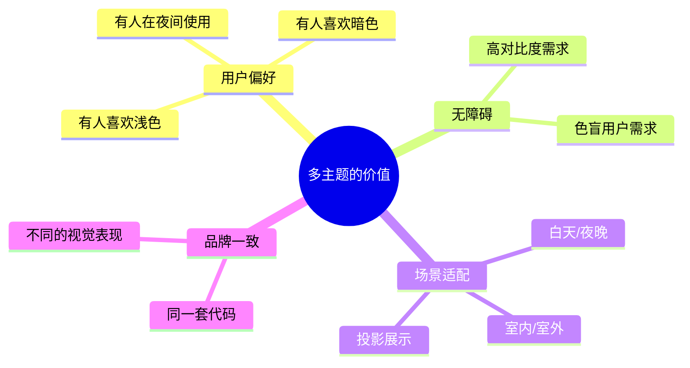
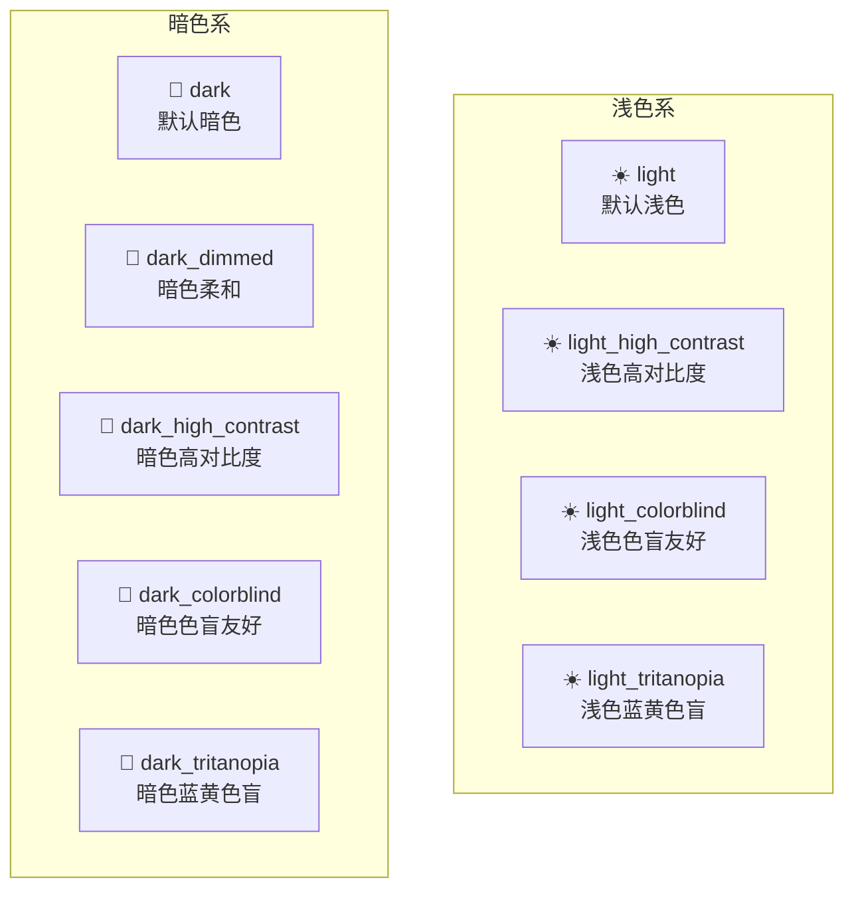
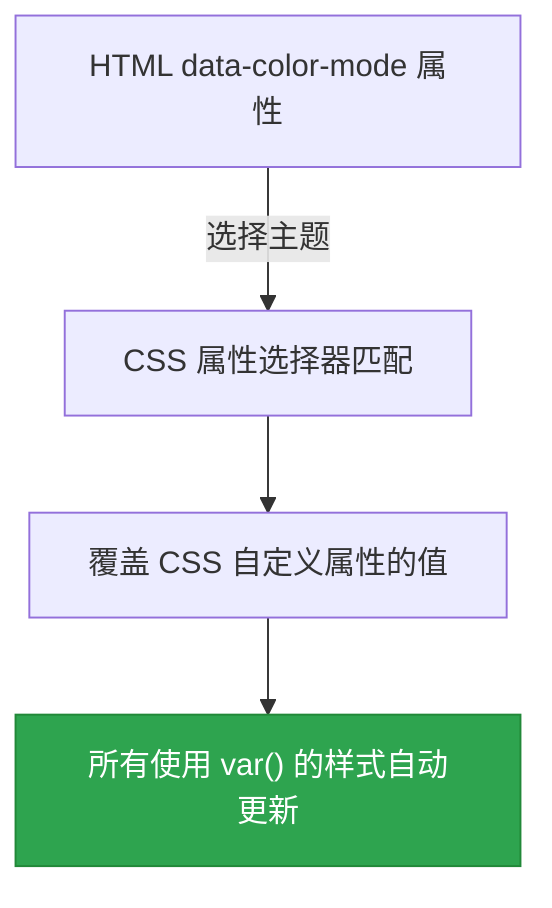
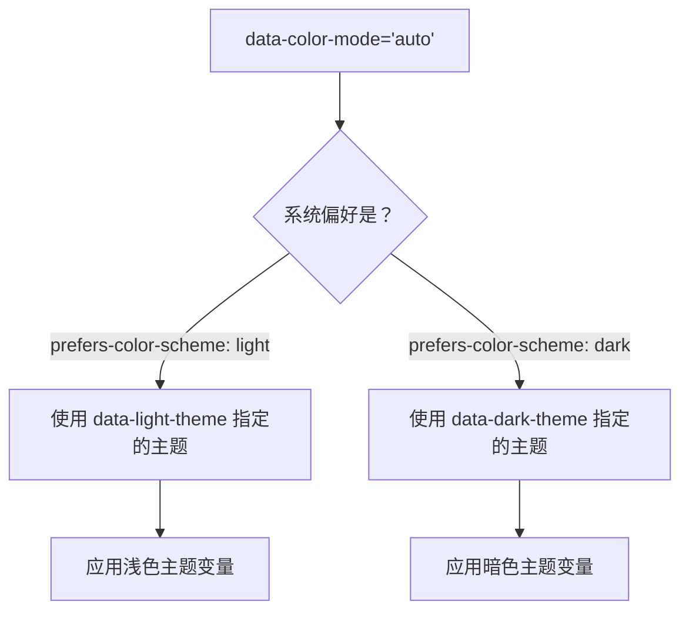
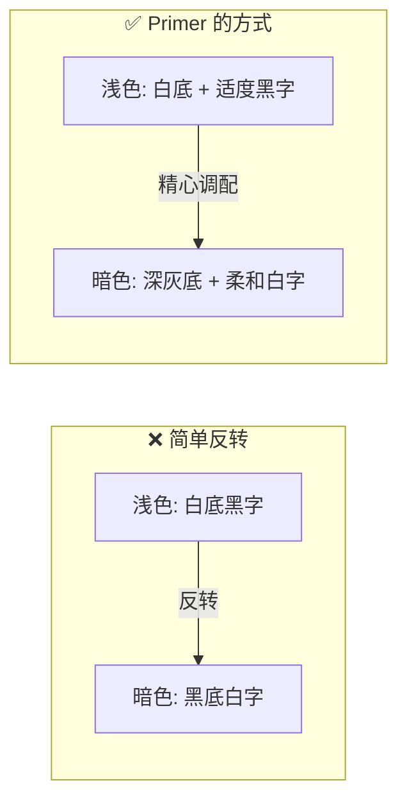
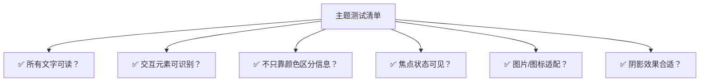

# 🌙 第10章：主题定制与暗黑模式

> 🧑‍💻 🎨 本章适合：前端开发者、UI 设计师

---

## 🎯 本章目标

理解 Primer CSS 的主题系统：暗黑模式的实现原理、如何切换主题、如何自定义主题、以及多主题的设计考量。

---

## 🤔 为什么需要多主题？



> 🍳 **通俗比喻**：主题切换就像汽车的"日间模式"和"夜间模式"。仪表盘上的信息不变（内容不变），但背光颜色会变（样式变）——白天用深色文字浅色背景方便看清，晚上用浅色文字深色背景减少刺眼。

---

## 🎨 Primer 的 9 大主题



### 每个主题的定位

| 主题 | 目标用户 | 特点 |
|------|---------|------|
| `light` | 普通用户（白天） | 默认主题，白底黑字 |
| `dark` | 普通用户（夜晚） | 深色背景，减少蓝光 |
| `dark_dimmed` | 喜欢柔和暗色的用户 | 比 dark 更柔和 |
| `light_high_contrast` | 视力较弱的用户 | 更高的颜色对比度 |
| `dark_high_contrast` | 视力较弱+暗色偏好 | 暗色 + 高对比度 |
| `light_colorblind` | 红绿色盲用户 | 避免红绿混淆 |
| `dark_colorblind` | 红绿色盲+暗色偏好 | 暗色 + 色盲友好 |
| `light_tritanopia` | 蓝黄色觉异常用户 | 避免蓝黄混淆 |
| `dark_tritanopia` | 蓝黄色觉异常+暗色 | 暗色 + 蓝黄友好 |

---

## ⚙️ 主题切换原理

### 核心机制：CSS 自定义属性 + 属性选择器



### 具体实现

**第一步：定义主题变量**

```scss
// src/color-modes/themes/light.scss（简化）
[data-color-mode="light"],
[data-color-mode="auto"][data-light-theme="light"] {
  --fgColor-default: #1f2328;
  --fgColor-muted: #636c76;
  --fgColor-accent: #0969da;
  --bgColor-default: #ffffff;
  --bgColor-muted: #f6f8fa;
  --borderColor-default: #d0d7de;
  // ... 更多变量
}

// src/color-modes/themes/dark.scss（简化）
[data-color-mode="dark"],
[data-color-mode="auto"][data-dark-theme="dark"] {
  --fgColor-default: #e6edf3;
  --fgColor-muted: #8d96a0;
  --fgColor-accent: #4493f8;
  --bgColor-default: #0d1117;
  --bgColor-muted: #161b22;
  --borderColor-default: #30363d;
  // ... 更多变量
}
```

**第二步：组件使用变量（不需要知道具体颜色值）**

```scss
.btn-primary {
  color: var(--fgColor-onEmphasis);
  background-color: var(--bgColor-accent-emphasis);
  border-color: var(--borderColor-accent-emphasis);
}
// 不管是浅色还是暗色主题，这段代码都不需要改
```

**第三步：HTML 中选择主题**

```html
<!-- 方式1：直接指定主题 -->
<html data-color-mode="light">

<!-- 方式2：跟随系统偏好 -->
<html data-color-mode="auto"
      data-light-theme="light"
      data-dark-theme="dark">

<!-- 方式3：强制暗色 -->
<html data-color-mode="dark" data-dark-theme="dark_dimmed">
```

---

## 💻 实战：实现主题切换

### 用 TypeScript 实现主题切换器

```typescript
// theme-switcher.ts

// 定义可用的主题类型
type ColorMode = 'light' | 'dark' | 'auto';
type LightTheme = 'light' | 'light_high_contrast' | 'light_colorblind' | 'light_tritanopia';
type DarkTheme = 'dark' | 'dark_dimmed' | 'dark_high_contrast' | 'dark_colorblind' | 'dark_tritanopia';

interface ThemeConfig {
  colorMode: ColorMode;
  lightTheme: LightTheme;
  darkTheme: DarkTheme;
}

// 默认主题配置
const DEFAULT_THEME: ThemeConfig = {
  colorMode: 'auto',
  lightTheme: 'light',
  darkTheme: 'dark',
};

/**
 * 应用主题到 HTML 根元素
 */
function applyTheme(config: ThemeConfig): void {
  const root = document.documentElement;

  root.setAttribute('data-color-mode', config.colorMode);
  root.setAttribute('data-light-theme', config.lightTheme);
  root.setAttribute('data-dark-theme', config.darkTheme);

  // 保存到 localStorage
  localStorage.setItem('theme', JSON.stringify(config));
}

/**
 * 从 localStorage 恢复主题
 */
function restoreTheme(): ThemeConfig {
  const saved = localStorage.getItem('theme');
  if (saved) {
    try {
      return JSON.parse(saved) as ThemeConfig;
    } catch {
      return DEFAULT_THEME;
    }
  }
  return DEFAULT_THEME;
}

/**
 * 快速切换浅色/暗色
 */
function toggleColorMode(): void {
  const current = document.documentElement.getAttribute('data-color-mode');
  const newMode: ColorMode = current === 'dark' ? 'light' : 'dark';

  const config = restoreTheme();
  config.colorMode = newMode;
  applyTheme(config);
}

// 初始化
document.addEventListener('DOMContentLoaded', () => {
  const config = restoreTheme();
  applyTheme(config);
});
```

### HTML 主题切换按钮

```html
<!-- 主题切换按钮 -->
<div class="d-flex flex-items-center gap-2 p-3">
  <span class="color-fg-muted f6">主题：</span>

  <button class="btn btn-sm" onclick="applyTheme({colorMode:'light', lightTheme:'light', darkTheme:'dark'})">
    ☀️ 浅色
  </button>

  <button class="btn btn-sm" onclick="applyTheme({colorMode:'dark', lightTheme:'light', darkTheme:'dark'})">
    🌙 暗色
  </button>

  <button class="btn btn-sm" onclick="applyTheme({colorMode:'dark', lightTheme:'light', darkTheme:'dark_dimmed'})">
    🌗 暗色柔和
  </button>

  <button class="btn btn-sm" onclick="applyTheme({colorMode:'auto', lightTheme:'light', darkTheme:'dark'})">
    💻 跟随系统
  </button>
</div>
```

---

## 🔍 深入理解 `auto` 模式

`auto` 模式利用浏览器的 `prefers-color-scheme` 媒体查询：



```scss
// auto 模式的 CSS 实现原理
[data-color-mode="auto"] {
  // 默认使用浅色
  @media (prefers-color-scheme: light) {
    &[data-light-theme="light"] {
      --fgColor-default: #1f2328;
      --bgColor-default: #ffffff;
      // ...
    }
  }

  @media (prefers-color-scheme: dark) {
    &[data-dark-theme="dark"] {
      --fgColor-default: #e6edf3;
      --bgColor-default: #0d1117;
      // ...
    }
  }
}
```

---

## 🎨 编写主题感知的自定义样式

### 规则：永远使用 CSS 变量

```scss
// ❌ 硬编码颜色——主题切换时不会变
.my-sidebar {
  background: #f6f8fa;
  border-right: 1px solid #d0d7de;
  color: #24292f;
}

// ✅ 使用 CSS 变量——自动适应主题
.my-sidebar {
  background: var(--bgColor-muted);
  border-right: 1px solid var(--borderColor-default);
  color: var(--fgColor-default);
}
```

### 如果需要主题特定的样式

```scss
// 有些效果在不同主题下需要不同处理
.my-card {
  // 基础样式（主题无关）
  border-radius: 6px;
  padding: 16px;

  // 使用 CSS 变量（自动适应）
  background: var(--bgColor-default);
  box-shadow: var(--shadow-medium);
}
```

---

## 📐 主题设计原则

### 1. 不只是"反转颜色"



> 🍳 **通俗比喻**：暗黑模式不是简单地把照片变成"底片"。好的暗黑模式就像"夜间摄影"——需要重新调光、调色，让画面在暗环境下依然好看且舒适。

### 2. 层级关系保持一致

```
浅色模式层级：    暗色模式层级：
背景 #ffffff     背景 #0d1117     ← 最底层
卡片 #f6f8fa     卡片 #161b22     ← 上浮一层
弹窗 #ffffff     弹窗 #1c2128     ← 再上浮
```

### 3. 对比度标准

| 元素 | 浅色对比度 | 暗色对比度 | 标准 |
|------|-----------|-----------|------|
| 正文 | ≥ 4.5:1 | ≥ 4.5:1 | WCAG AA |
| 大标题 | ≥ 3:1 | ≥ 3:1 | WCAG AA |
| 非文字元素 | ≥ 3:1 | ≥ 3:1 | WCAG AA |

---

## 🧪 测试你的主题

### 检查清单



### 用代码测试对比度

```typescript
/**
 * 计算两个颜色之间的对比度
 * 基于 WCAG 2.1 算法
 */
function getContrastRatio(hex1: string, hex2: string): number {
  const luminance1 = getRelativeLuminance(hex1);
  const luminance2 = getRelativeLuminance(hex2);
  const lighter = Math.max(luminance1, luminance2);
  const darker = Math.min(luminance1, luminance2);
  return (lighter + 0.05) / (darker + 0.05);
}

function getRelativeLuminance(hex: string): number {
  const rgb = hexToRgb(hex);
  const [r, g, b] = rgb.map((c: number) => {
    c = c / 255;
    return c <= 0.03928 ? c / 12.92 : Math.pow((c + 0.055) / 1.055, 2.4);
  });
  return 0.2126 * r + 0.7152 * g + 0.0722 * b;
}

function hexToRgb(hex: string): number[] {
  const result = /^#?([a-f\d]{2})([a-f\d]{2})([a-f\d]{2})$/i.exec(hex);
  return result
    ? [parseInt(result[1], 16), parseInt(result[2], 16), parseInt(result[3], 16)]
    : [0, 0, 0];
}

// 使用示例
const ratio = getContrastRatio('#1f2328', '#ffffff');
console.log(`对比度: ${ratio.toFixed(2)}:1`);
// 输出: "对比度: 15.39:1" — 远超 WCAG AA 标准的 4.5:1
```

---

## 🎓 本章小结

| 概念 | 说明 |
|------|------|
| 9 大主题 | 浅色/暗色 × 标准/高对比度/色盲友好 |
| 核心机制 | CSS 自定义属性 + data 属性选择器 |
| auto 模式 | 跟随系统 `prefers-color-scheme` 偏好 |
| 主题切换 | 修改 `data-color-mode` 属性即可 |
| 设计原则 | 不是简单反转，需精心调配每个颜色 |
| 自定义样式 | 永远使用 `var()` 引用颜色变量 |

### 主题相关的关键属性

```html
<!-- HTML 属性 -->
data-color-mode="light|dark|auto"
data-light-theme="light|light_high_contrast|light_colorblind|light_tritanopia"
data-dark-theme="dark|dark_dimmed|dark_high_contrast|dark_colorblind|dark_tritanopia"
```

---

**上一章** 👈 [第9章：工具类（Utility Classes）](./09-utilities.md)

**下一章** 👉 [第11章：最佳实践与进阶技巧](./11-best-practices.md)
