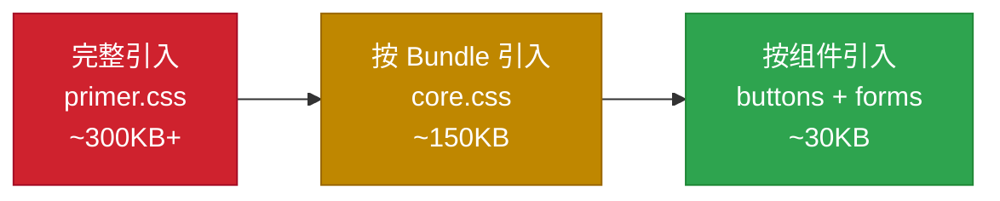
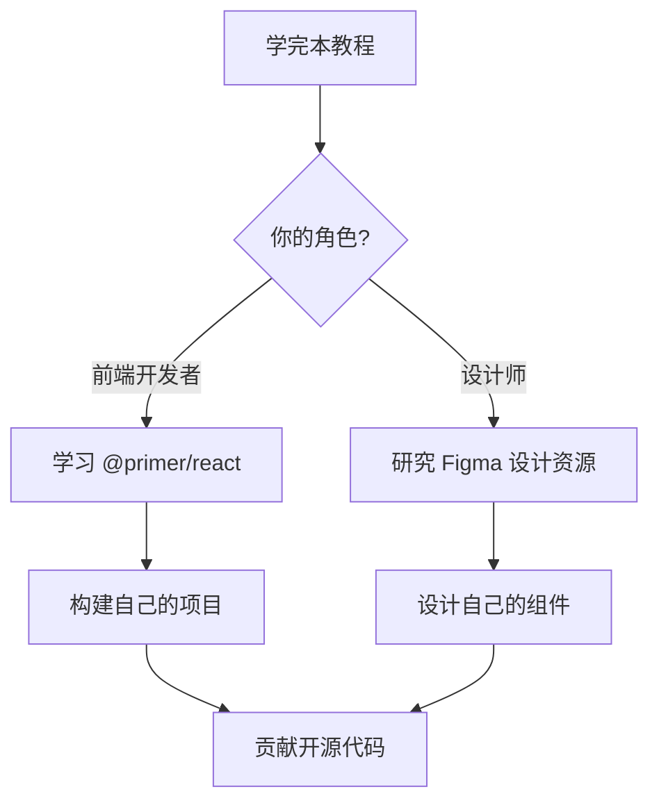

# 💡 第11章：最佳实践与进阶技巧

> 🧑‍💻 本章适合：前端开发者

---

## 🎯 本章目标

学习使用 Primer CSS 的最佳实践：性能优化、代码组织、常见陷阱、以及与现代前端框架的集成。

---

## ⚡ 性能优化

### 1. 按需引入



```scss
// ❌ 引入全部（不推荐用于生产）
@import '@primer/css/index.scss';

// ✅ 按需引入（推荐）
@import '@primer/css/support/index.scss';  // 必须
@import '@primer/css/base/index.scss';     // 推荐
@import '@primer/css/buttons/index.scss';  // 需要的组件
@import '@primer/css/forms/index.scss';
@import '@primer/css/utilities/index.scss';
```

### 2. 利用 CSS 层叠，避免冗余

```scss
// ❌ 重复定义
.my-card {
  display: flex;
  align-items: center;
  justify-content: center;
  padding: 16px;
  margin-bottom: 8px;
}

// ✅ 使用工具类代替
// HTML: <div class="d-flex flex-items-center flex-justify-center p-3 mb-2">
// 不需要写额外的 CSS
```

### 3. 避免样式覆盖链

```scss
// ❌ 覆盖 Primer 的样式（高优先级战争）
.btn.btn-primary.my-special-btn {
  background-color: purple !important;  // 😱 !important 是代码味道
}

// ✅ 创建新的组件类
.btn-brand {
  background-color: var(--my-brand-color);
  color: var(--fgColor-onEmphasis);
  border: none;
  border-radius: 6px;
  padding: 8px 16px;
}
```

---

## 📁 代码组织最佳实践

### 项目样式文件结构

```
src/styles/
├── _variables.scss      # 自定义变量（如品牌色）
├── _components.scss     # 自定义组件样式
├── _overrides.scss      # 必要的 Primer 覆盖
├── _pages.scss          # 页面级别样式
└── main.scss            # 主入口
```

```scss
// main.scss
// 1. Primer CSS 基础
@import '@primer/css/support/index.scss';
@import '@primer/css/base/index.scss';

// 2. 自定义变量
@import './variables';

// 3. Primer 组件（按需引入）
@import '@primer/css/buttons/index.scss';
@import '@primer/css/forms/index.scss';
@import '@primer/css/box/index.scss';
@import '@primer/css/labels/index.scss';

// 4. Primer 工具类
@import '@primer/css/utilities/index.scss';

// 5. 自定义组件（在 Primer 之后，便于利用变量）
@import './components';

// 6. 页面特定样式
@import './pages';

// 7. 覆盖样式（最后加载）
@import './overrides';
```

### 自定义变量文件

```scss
// _variables.scss

// 品牌色——利用 Primer 的 CSS 自定义属性系统
:root {
  --my-brand-color: #6f42c1;
  --my-brand-color-light: #8b5cf6;
  --my-brand-color-dark: #5a32a3;
}

// 自定义间距（基于 Primer 的 4px 网格）
$my-card-padding: $spacer-4;      // 24px
$my-section-gap: $spacer-5;       // 32px
$my-page-max-width: 1280px;
```

---

## 🚫 常见陷阱与解决方案

### 陷阱1：忘记引入 Support

```scss
// ❌ 直接引入组件（报错！找不到变量）
@import '@primer/css/buttons/index.scss';

// ✅ 先引入 Support
@import '@primer/css/support/index.scss';
@import '@primer/css/buttons/index.scss';
```

> Support 模块包含所有其他模块依赖的变量和 mixin。没有它，其他模块中的 `$spacer-3`、`$border-radius` 等变量就找不到。

### 陷阱2：类名顺序不影响优先级

```html
<!-- ⚠️ CSS 类名在 HTML 中的顺序不影响优先级 -->
<div class="p-2 p-4">
  <!-- padding 是 8px 还是 24px？取决于 CSS 文件中的定义顺序，不是 HTML 中的 -->
</div>

<!-- ✅ 同一属性只用一个类 -->
<div class="p-4">
  <!-- 明确是 24px -->
</div>
```

### 陷阱3：颜色硬编码

```scss
// ❌ 硬编码颜色，暗黑模式下看不见
.my-badge {
  background: #f0f0f0;
  color: #333;
}

// ✅ 使用主题变量
.my-badge {
  background: var(--bgColor-neutral-muted);
  color: var(--fgColor-default);
}
```

### 陷阱4：忽略无障碍

```html
<!-- ❌ 图标按钮没有文字说明 -->
<button class="btn">
  🗑️
</button>

<!-- ✅ 添加无障碍标签 -->
<button class="btn" aria-label="删除">
  🗑️
</button>

<!-- ❌ 仅用颜色区分状态 -->
<span class="color-fg-danger">失败</span>
<span class="color-fg-success">成功</span>

<!-- ✅ 颜色 + 文字/图标 -->
<span class="color-fg-danger">❌ 失败</span>
<span class="color-fg-success">✅ 成功</span>
```

---

## ⚛️ 与现代框架集成

### React + Primer CSS

```tsx
// 方式1：直接使用 CSS 类名
import '@primer/css/dist/primer.css';

function IssueCard({ title, status, labels }: {
  title: string;
  status: 'open' | 'closed';
  labels: string[];
}) {
  return (
    <div className="Box-row d-flex flex-items-center">
      <span className={`color-fg-${status === 'open' ? 'success' : 'danger'} mr-2`}>
        {status === 'open' ? '●' : '○'}
      </span>
      <a href="#" className="color-fg-default text-bold flex-auto">
        {title}
      </a>
      <div className="d-flex gap-1">
        {labels.map(label => (
          <span key={label} className="Label Label--secondary">
            {label}
          </span>
        ))}
      </div>
    </div>
  );
}

// 使用
<IssueCard
  title="修复登录页面 Bug"
  status="open"
  labels={['bug', 'priority: high']}
/>
```

```tsx
// 方式2：配合 @primer/react 使用（推荐）
// @primer/react 是 Primer 的 React 组件库，内部使用了 Primer CSS
import { Button, Box, Label } from '@primer/react';

function MyComponent() {
  return (
    <Box p={3} borderWidth={1} borderStyle="solid" borderColor="border.default" borderRadius={2}>
      <Button variant="primary">主要按钮</Button>
      <Label>标签</Label>
    </Box>
  );
}
```

### Vue + Primer CSS

```vue
<!-- Vue 组件中使用 Primer CSS -->
<template>
  <div class="Box p-3">
    <div class="Box-header d-flex flex-items-center flex-justify-between">
      <h3 class="Box-title f4">{{ title }}</h3>
      <span class="Counter">{{ count }}</span>
    </div>
    <div class="Box-body">
      <slot></slot>
    </div>
  </div>
</template>

<script setup lang="ts">
defineProps<{
  title: string;
  count: number;
}>();
</script>
```

---

## 📋 实战：构建一个完整页面

将所有知识综合运用，构建一个 GitHub 风格的仓库页面：

```html
<!DOCTYPE html>
<html lang="zh-CN" data-color-mode="auto" data-light-theme="light" data-dark-theme="dark">
<head>
  <meta charset="UTF-8">
  <meta name="viewport" content="width=device-width, initial-scale=1.0">
  <title>我的仓库</title>
  <link rel="stylesheet" href="https://unpkg.com/@primer/css@22/dist/primer.css">
</head>
<body class="color-bg-default">
  <!-- 顶部导航 -->
  <header class="Header">
    <div class="Header-item">
      <a href="#" class="Header-link f4">🐙 MyGitHub</a>
    </div>
    <div class="Header-item Header-item--full">
      <input class="form-control Header-input" type="search"
             placeholder="搜索..." style="max-width: 300px;">
    </div>
    <div class="Header-item mr-0">
      
    </div>
  </header>

  <!-- 主内容 -->
  <main class="mx-auto p-3 p-md-4" style="max-width: 1012px;">
    <!-- 仓库信息 -->
    <div class="mb-4">
      <h1 class="f2 text-bold d-flex flex-items-center">
        <span class="color-fg-muted mr-1">octocat /</span>
        <span class="color-fg-accent">hello-world</span>
        <span class="Label Label--secondary ml-2">Public</span>
      </h1>
      <p class="color-fg-muted f5 mt-1">这是一个示例仓库 🎉</p>
    </div>

    <!-- 操作按钮 -->
    <div class="d-flex flex-wrap gap-2 mb-4">
      <button class="btn btn-sm">⭐ Star <span class="Counter">42</span></button>
      <button class="btn btn-sm">🍴 Fork <span class="Counter">12</span></button>
      <button class="btn btn-sm">👀 Watch <span class="Counter">5</span></button>
    </div>

    <!-- 文件列表 -->
    <div class="Box">
      <div class="Box-header d-flex flex-items-center">
        
        <span class="text-bold f5 mr-1">octocat</span>
        <span class="color-fg-muted f6">最新提交信息</span>
        <span class="color-fg-muted f6 ml-auto">2 天前</span>
      </div>

      <div class="Box-row d-flex flex-items-center">
        <span class="color-fg-accent mr-2">📁</span>
        <a href="#" class="color-fg-default flex-auto">src</a>
        <span class="color-fg-muted f6">添加源码目录</span>
        <span class="color-fg-muted f6 ml-3 ws-nowrap">3 天前</span>
      </div>

      <div class="Box-row d-flex flex-items-center">
        <span class="color-fg-accent mr-2">📁</span>
        <a href="#" class="color-fg-default flex-auto">docs</a>
        <span class="color-fg-muted f6">更新文档</span>
        <span class="color-fg-muted f6 ml-3 ws-nowrap">1 天前</span>
      </div>

      <div class="Box-row d-flex flex-items-center">
        <span class="color-fg-muted mr-2">📄</span>
        <a href="#" class="color-fg-default flex-auto">README.md</a>
        <span class="color-fg-muted f6">初始化项目</span>
        <span class="color-fg-muted f6 ml-3 ws-nowrap">5 天前</span>
      </div>

      <div class="Box-row d-flex flex-items-center">
        <span class="color-fg-muted mr-2">📄</span>
        <a href="#" class="color-fg-default flex-auto">package.json</a>
        <span class="color-fg-muted f6">添加依赖</span>
        <span class="color-fg-muted f6 ml-3 ws-nowrap">2 天前</span>
      </div>
    </div>

    <!-- README 展示 -->
    <div class="Box mt-4">
      <div class="Box-header">
        <h2 class="Box-title f5">📖 README.md</h2>
      </div>
      <div class="Box-body markdown-body p-4">
        <h1>Hello World 🌍</h1>
        <p>这是一个使用 Primer CSS 构建的示例项目。</p>
        <h2>特性</h2>
        <ul>
          <li>✅ 响应式设计</li>
          <li>✅ 暗黑模式</li>
          <li>✅ 无障碍支持</li>
        </ul>
        <h2>快速开始</h2>
        <pre class="p-3 color-bg-subtle rounded-2">
          <code class="text-mono">npm install && npm start</code>
        </pre>
      </div>
    </div>
  </main>

  <!-- 页脚 -->
  <footer class="p-4 mt-6 border-top text-center color-fg-muted f6">
    <p>使用 Primer CSS 构建 · © 2024</p>
  </footer>
</body>
</html>
```

---

## 📚 学习资源汇总

### 官方资源

| 资源 | 链接 | 说明 |
|------|------|------|
| Primer CSS 文档 | [primer.style/css](https://primer.style/css) | 官方文档 |
| Primer React | [primer.style/react](https://primer.style/react) | React 组件库 |
| Primer 设计指南 | [primer.style](https://primer.style) | 设计系统总站 |
| GitHub 仓库 | [github.com/primer/css](https://github.com/primer/css) | 源码 |
| npm 包 | [npmjs.com/package/@primer/css](https://www.npmjs.com/package/@primer/css) | npm |

### 推荐学习路径



---

## ✅ 学习检查清单

完成本教程后，你应该能够：

- [ ] 解释什么是设计系统以及为什么需要它
- [ ] 安装和引入 Primer CSS
- [ ] 理解三层架构（Support → Components → Utilities）
- [ ] 使用设计令牌而不是硬编码值
- [ ] 运用颜色系统的语义化命名
- [ ] 使用排版系统的字号、字重、行高
- [ ] 使用间距系统的 margin 和 padding 类
- [ ] 使用 Flexbox 工具类构建布局
- [ ] 使用按钮、表单、Box 等核心组件
- [ ] 理解工具类的设计理念和使用场景
- [ ] 实现主题切换和暗黑模式
- [ ] 遵循无障碍设计原则
- [ ] 将 Primer CSS 集成到现代前端项目中

---

## 🎓 本章小结

| 实践 | 说明 |
|------|------|
| 按需引入 | 只加载需要的模块，减少文件大小 |
| 先引 Support | 所有其他模块依赖 Support 层 |
| 使用 CSS 变量 | 颜色始终用 `var()`，支持主题切换 |
| 避免 !important | 创建新类而不是覆盖已有类 |
| 无障碍优先 | 始终添加 aria 属性，不仅靠颜色传达信息 |
| 工具类适度 | 超过 5-6 个工具类时考虑创建组件 |

---

🎉 **恭喜你完成了所有章节的学习！**

你现在已经掌握了 Primer CSS 的核心知识。接下来，用它来构建你自己的项目吧！

**回到目录** 👈 [README](./README.md)

**上一章** 👈 [第10章：主题定制与暗黑模式](./10-theming.md)
