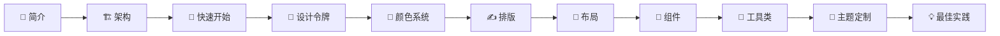

# 📚 Primer CSS 学习教程

> **Primer CSS** 是 GitHub 官方设计系统的 CSS 实现。本教程将带你由浅入深地掌握 Primer CSS 的核心概念和实践技巧。

---

## 🎯 这个教程适合谁？

本教程面向两类读者：

| 角色 | 关注点 | 推荐学习路径 |
|------|--------|-------------|
| 🧑‍💻 **前端开发者** | 代码实现、组件用法、构建集成 | 完整路径 |
| 🎨 **UI 设计师** | 设计规范、颜色系统、排版规则 | 设计路径 |

---

## 🗺️ 学习路径

### 🧑‍💻 前端开发者路径（完整路径）

按照以下顺序学习，每一章都建立在前一章的基础上：

```
第1章 → 第2章 → 第3章 → 第4章 → 第5章 → 第6章 → 第7章 → 第8章 → 第9章 → 第10章 → 第11章
```



### 🎨 UI 设计师路径

设计师可以跳过代码实现细节，关注设计规范部分：


推荐顺序：**第1章 → 第4章 → 第5章 → 第6章 → 第7章 → 第8章（概览部分）→ 第10章**

---

## 📖 教程目录

| 章节 | 标题 | 简介 | 适合角色 |
|------|------|------|---------|
| [第1章](./01-introduction.md) | 📖 Primer CSS 简介 | 了解 Primer CSS 是什么、为什么 GitHub 选择它 | 🧑‍💻 🎨 |
| [第2章](./02-architecture.md) | 🏗️ 项目架构与设计理念 | 深入理解项目结构、设计模式和工程化思路 | 🧑‍💻 |
| [第3章](./03-getting-started.md) | 🚀 快速开始 | 安装、引入、写出第一个页面 | 🧑‍💻 |
| [第4章](./04-design-tokens.md) | 🎨 设计令牌（Design Tokens） | 理解设计系统的"原子"——变量和令牌 | 🧑‍💻 🎨 |
| [第5章](./05-color-system.md) | 🌈 颜色系统与主题 | 颜色规范、语义化颜色、无障碍设计 | 🧑‍💻 🎨 |
| [第6章](./06-typography.md) | ✍️ 排版系统 | 字体、字号、行高、排版规则 | 🧑‍💻 🎨 |
| [第7章](./07-layout.md) | 📐 布局与间距 | 间距系统、断点、响应式布局 | 🧑‍💻 🎨 |
| [第8章](./08-components.md) | 🧩 核心组件详解 | 按钮、表单、导航、标签等组件用法 | 🧑‍💻 🎨 |
| [第9章](./09-utilities.md) | 🔧 工具类（Utility Classes） | 工具类设计理念、使用方式、常用类大全 | 🧑‍💻 |
| [第10章](./10-theming.md) | 🌙 主题定制与暗黑模式 | 主题切换原理、自定义主题开发 | 🧑‍💻 🎨 |
| [第11章](./11-best-practices.md) | 💡 最佳实践与进阶技巧 | 性能优化、代码组织、实战技巧 | 🧑‍💻 |

---

## ⏱️ 学习时间建议

| 路径 | 预计时间 | 说明 |
|------|---------|------|
| 🧑‍💻 前端开发者完整路径 | 4-6 小时 | 包含动手实践时间 |
| 🎨 UI 设计师路径 | 2-3 小时 | 侧重设计规范理解 |
| 快速上手（仅第1、3章） | 30 分钟 | 适合赶时间的开发者 |

---

## 🔗 相关资源

- 🌐 [Primer 官方文档](https://primer.style/css)
- 📦 [npm 包](https://www.npmjs.com/package/@primer/css)
- 🐙 [GitHub 仓库](https://github.com/primer/css)
- ⚛️ [Primer React 组件库](https://primer.style/react)
- 🎨 [Primer 设计令牌](https://www.npmjs.com/package/@primer/primitives)

---

## 📝 说明

- 本教程基于 **Primer CSS v22.x** 版本编写
- 代码示例以 HTML + CSS/SCSS 为主，部分涉及 TypeScript
- 文档中 `🧑‍💻` 标识前端开发者关注内容，`🎨` 标识设计师关注内容
- 遇到问题欢迎提 Issue 讨论

**开始学习吧！** 👉 [第1章：Primer CSS 简介](./01-introduction.md)
